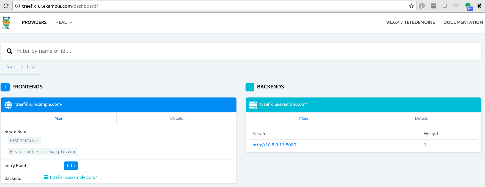

# Ingress - Traefik
If we look at Service as an endpoint, then the Kubernetes ingress object is a DNS look-alike.
It takes care of things like load balancing traffic, terminating SSL and naming among other things.

To enable an ingress object, we need an ingress controller. In this example we will be using [Træfik](https://traefik.io/). If you prefer [NGINX there is another exercise doing it with NGINX](./05-ingress-nginx.md).


## Related RBAC configuration:
Create a file named traefik-rbac.yaml with the following contents. This will setup correct global cluster role binding.

```yaml,k8s
kind: ClusterRole
apiVersion: rbac.authorization.k8s.io/v1beta1
metadata:
  name: traefik-ingress-controller
rules:
  - apiGroups:
      - ""
    resources:
      - services
      - endpoints
      - secrets
    verbs:
      - get
      - list
      - watch
  - apiGroups:
      - extensions
    resources:
      - ingresses
    verbs:
      - get
      - list
      - watch
---
kind: ClusterRoleBinding
apiVersion: rbac.authorization.k8s.io/v1beta1
metadata:
  name: traefik-ingress-controller
roleRef:
  apiGroup: rbac.authorization.k8s.io
  kind: ClusterRole
  name: traefik-ingress-controller
subjects:
- kind: ServiceAccount
  name: traefik-ingress-controller
  namespace: kube-system
```

Create the traefik RBAC configuration using:
```shell
kubectl create -f ingress-traefik/traefik-rbac.yaml
```

## Deploy Traefik:
Create a file named traefik-deployment.yaml with the following contents.

```yaml,k8s
apiVersion: v1
kind: ServiceAccount
metadata:
  name: traefik-ingress-controller
  namespace: kube-system
---
kind: Deployment
apiVersion: apps/v1
metadata:
  name: traefik-ingress-controller
  namespace: kube-system
  labels:
    k8s-app: traefik-ingress-lb
spec:
  replicas: 1
  selector:
    matchLabels:
      k8s-app: traefik-ingress-lb
  template:
    metadata:
      labels:
        k8s-app: traefik-ingress-lb
        name: traefik-ingress-lb
    spec:
      serviceAccountName: traefik-ingress-controller
      terminationGracePeriodSeconds: 60
      containers:
      - image: traefik
        name: traefik-ingress-lb
        ports:
        - name: http
          containerPort: 80
        - name: admin
          containerPort: 8080
        args:
        - --api
        - --kubernetes
        - --logLevel=INFO
---
kind: Service
apiVersion: v1
metadata:
  name: traefik-ingress-service
  namespace: kube-system
spec:
  selector:
    k8s-app: traefik-ingress-lb
  ports:
    - protocol: TCP
      port: 80
      name: web
    - protocol: TCP
      port: 8080
      name: admin
  type: LoadBalancer
```
**Note: You can also use type: NodePort** in the Service section above. 


Create the objects defined in the traefik-deployment.yaml:
```shell
kubectl create -f ingress-traefik/traefik-deployment.yaml
```


## Create Ingress for Traefik Web-UI:
Create a file traefik-webui-ingress.yaml with the following contents to create a Service and an Ingress that will expose the Traefik Web UI.
```yaml,k8s
apiVersion: v1
kind: Service
metadata:
  name: traefik-web-ui
  namespace: kube-system
spec:
  selector:
    k8s-app: traefik-ingress-lb
  ports:
  - name: web
    port: 80
    targetPort: 8080
---
apiVersion: extensions/v1beta1
kind: Ingress
metadata:
  name: traefik-web-ui
  namespace: kube-system
spec:
  rules:
  - host: traefik-ui.example.com
    http:
      paths:
      - path: /
        backend:
          serviceName: traefik-web-ui
          servicePort: web
``` 

Create the objects:
```shell
kubectl create -f traefik-webui-ingress.yaml
```


You can check the public IP of the Traefik service, and on your local computer, edit the `/etc/hosts` file to set up name resolution for this IP as:

```
127.0.0.1   	localhost localhost.localdomain
35.240.21.22	traefik-ui.example.com www.example.com
```

OR. If you have a domain under your control, setup DNS accordingly. You can use any other DNS name for your setup other than example.com. 

Now visit the address `traefik-ui.example.com` , you should see a dashboard.



## Setup additional ingress for your application(s):
It's time to setup an additional service for any of our application. For now, I will use a simple nginx web server. Create a file examplenginx-deployment.yaml with the following contents:

```yaml,k8s
apiVersion: apps/v1
kind: Deployment
metadata:
  name: nginx
  labels:
    app: nginx
spec:
  replicas: 1
  selector:
    matchLabels:
      app: nginx
  template:
    metadata:
      labels:
        app: nginx
    spec:
      containers:
      - name: nginx
        image: nginx:1.7.9
        ports:
        - containerPort: 80

---

apiVersion: v1
kind: Service
metadata:
  name: nginx
  labels:
    name: nginx
    app: nginx
spec:
  ports:
    - port: 80
  selector:
    app: nginx

---

apiVersion: extensions/v1beta1
kind: Ingress
metadata:
  namespace: default
  name: example-nginx-ingress
  labels:
    app: nginx
spec:
  rules:
  - host: www.example.com
    http:
      paths:
      - path: /
        backend:
          serviceName: nginx
          servicePort: 80
```

Create the objects from the above file:

```shell
kubectl create -f ingress-traefik/example-nginx-deployment.yaml
```


If you visit the Traefik dashboard now, you should be able to see a new ingress pop up. Visit the web page `www.example.com` to verify that you can access the nginx web server.


Visiting www.example.com should show nginx webpage:

```shell
$ curl www.example.com
<!DOCTYPE html>
<html>
<head>
<title>Welcome to nginx!</title>
<style>
    body {
        width: 35em;
        margin: 0 auto;
        font-family: Tahoma, Verdana, Arial, sans-serif;
    }
</style>
</head>
<body>
<h1>Welcome to nginx!</h1>
<p>If you see this page, the nginx web server is successfully installed and
working. Further configuration is required.</p>

<p>For online documentation and support please refer to
<a href="http://nginx.org/">nginx.org</a>.<br/>
Commercial support is available at
<a href="http://nginx.com/">nginx.com</a>.</p>

<p><em>Thank you for using nginx.</em></p>
</body>
</html>
```


------------
(Ignore anything below this line - for now)


So, therefore we start with the ingress controller: 
```shell
kubectl create -f ingress-traefik/traefik-ingress-controller.yml
```

Ingress has a nice little GUI which shows current ingress rules and settings in a cluster, which we can take advantage of to create an overview. 

Create the service: 
```shell
kubectl create -f ingress-traefik/traefik-service.yml
```
... and the ingress rule: 
```shell
kubectl create -f ingress-traefik/traefik-ingress.yml
```

Instead of going through the trouble of setting up a proper DNS, we can modify the host file - below is an example of doing this for minikube:
```shell
echo "$(minikube ip) traefik-ui.local" | sudo tee -a /etc/hosts
```

To make it work for your cluster, replace the minikube ip with a node ip. 

Which means you can access it like by clicking http://traefik-ui.local

So the magic here is that: 
- You send a request which is translated to the node ip
- The node looks up the incoming name record and finds it in an ingress. 
- The ingress rule says that traffic from traefik-ui.local needs to go to backend service 'traefik-web-ui' on port 80
    * kubectl get svc traefik-web-ui -n kube-system
- The service then redirects to the container, in this case the ingress controller itself, on port 8080. 

Let's try with a different container. Deploy any given image and expose a service for it. 

```shell
kubectl create deployment ingress-test --image=<your-image>
kubectl scale deployment ingress-test  --replicas=3
kubectl expose deployment ingress-test --port=<your-port>
```

Then [go to the ingress] and modify the port (servicePort: replaceport), followed by: 
```shell
kubectl create -f ingress-traefik/my-ingress.yml
echo "$(minikube ip) myapp.local" | sudo tee -a /etc/hosts
```

Access it on http://myapp.local. 

This concludes the exercise for ingress. 

