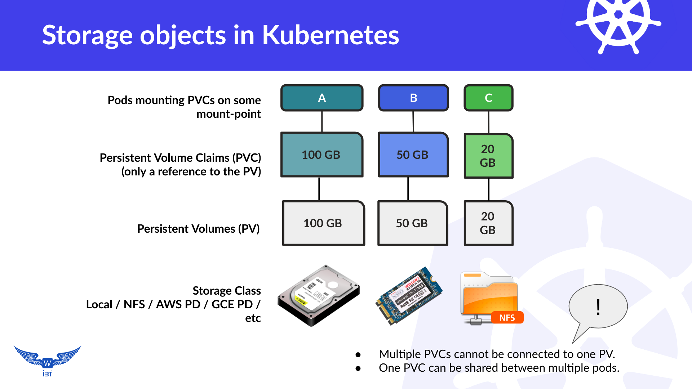

# Storage

This article shows how to provide persistent storage to your pods, so your data is safe across pod creation cycles. You will learn to create **PVs** and **PVCs** and how to use **storage classes**. You will also learn the difference of storage provisioning when using **Deployment** and **StatefulSet** objects.

|  |
| --------------------------------------------------------------- |

## Semi-Automatic / Semi-Dynamic provisioning - with Deployments:
When you want to provide some persistent storage to your pods, you define/create a persistent volume claim (PVC), which the pod consumes by the mounting this PVC at a certain mount-point in it's file system. As soon as the PVC is created (using dynamic provisioning), a corresponding persistent volume (PV) is created. The PV in-turn takes a slice of storage from the storage class. As soon as the PV acquires this storage slice, the PVC binds to the this PV.

A **storage class** has actual physical storage underneath it - provided/managed by the cloud provider; though, the storage class hides this information, and provides an abstraction layer for you. Normally, all cloud providers have a default storage class created for you, ready to be used.

**Note:** Minikube provides a `standard` storageclass of type `hostPath` out of the box. Kubeadm based clusters do not. 

**Notes:**
* I have referred to this method as **"Semi-Automatic"** or **"Semi-Dynamic"**, because, the PVC in this case is created manually, but the underlying PV is created automatically/dynamically. This is one of the two possible ways **to assign persistent storage to Deployments**. The other method is of-course to manually create both the PV and PVC.
* A **Fully-Automatic**" or "**Fully-Dynamic**" mechanism to create PV and PVCs automatically is available, but not for the **Deployment** object. That is available for **StatefulSet** object. More on this later.


Lets check what classes are available to us:

```
$ kubectl get sc

NAME                 PROVISIONER		AGE
standard (default)   kubernetes.io/gce-pd	1d
```
Good, so we have a storage class named `standard` , which we can use to create PVCs and PVs.


Here is what storageclasses looks like on minikube - just for completeness sake: 
```
$ kubectl get storageclass
NAME                 PROVISIONER                AGE
standard (default)   k8s.io/minikube-hostpath   19d
```

**Note:** It does not matter if you are using GCP, AWS, Azure, minikube, kubeadm, etc. Till the time you have a name for the storage class - which you can use in your PVC claims, you have no concern about the underlying physical storage. So, if you have a pvc claim definition file,(like the one below), and you are using it to create PVC on a **minikube** cluster, you can simply use the same PVC claim file to create a PVC with the same name on a **GCP** cluster. The abstraction allows you to *develop anywhere, deploy anywhere* !


If you do not have a storage class, you can create/define it yourself. All you need to know is type of provisioner to use. Here is a definition file to create a storage class named **slow** on a GCP k8s cluster:

```
$ cat support-files/gcp-storage-class.yaml 

kind: StorageClass
apiVersion: storage.k8s.io/v1
metadata:
  name: slow
provisioner: kubernetes.io/gce-pd
parameters:
  type: pd-standard
  replication-type: none
```

```
$ kubectl create -f support-files/gcp-storage-class.yaml
storageclass "slow" created
```

```
$ kubectl get sc

NAME                 PROVISIONER		AGE
standard (default)   kubernetes.io/gce-pd	1d
slow		             kubernetes.io/gce-pd	1h
```


**Note** All commands below are executed on a kubernetes cluster running on GCP. For any other provider, refer to corresponding documentation.

### Create and use a PVC:

Lets create a simple nginx deployment, which uses a PVC, which in-turn, provisions a PV automatically/dynamically. Here is the file to create a PVC named `pvc-nginx`:

```
$ cat support-files/pvc-nginx.yaml 
apiVersion: v1
kind: PersistentVolumeClaim
metadata:
  name: pvc-nginx
  labels:
    name: pvc-nginx
spec:
  storageClassName: "standard"
  accessModes:
    - ReadWriteOnce
  resources:
    requests:
      storage: 100Mi
```

```
$ kubectl create -f support-files/pvc-nginx.yaml
```

Check that the PVC exists and is bound:

```
$ kubectl get pvc
NAME        STATUS    VOLUME                                     CAPACITY   ACCESS MODES   STORAGECLASS   AGE
pvc-nginx   Bound     pvc-e8a4fc89-2bae-11e8-b065-42010a8400e3   100Mi      RWO            standard       4m
```

There should be a corresponding **auto-created**/**auto-provisioned** persistent volume (PV) against this PVC:

```
$ kubectl get pv
NAME                                       CAPACITY   ACCESS MODES   RECLAIM POLICY   STATUS    CLAIM               STORAGECLASS   REASON    AGE
pvc-e8a4fc89-2bae-11e8-b065-42010a8400e3   100Mi      RWO            Delete           Bound     default/pvc-nginx   standard                 5m
```
**Note:** Above may be confusing, and demands some explanation. The `pvc-nginx` **PVC** above, is being created manually, using a `yaml` file; but, the related **PV** is being created automatically. Kubernetes cannot guess it's name (obviously), so it gives it a random/unique name/ID, which begins with **pvc**. This ID is reflected in the **VOLUME**  column of the `kubectl get pvc` command.


Next, we are going to create a deployment, and the pod from this deployment will use this storage, by using the PVC. Here is the file `support-files/nginx-persistent-storage.yaml` , which shows how it is defined in `yaml` format:

```
$ cat support-files/nginx-persistent-storage.yaml

apiVersion: extensions/v1beta1
kind: Deployment
metadata:
  name: nginx-deployment
  labels:
    app: nginx
spec:
  replicas: 1
  selector:
    matchLabels:
      app: nginx
  template:
    metadata:
      labels:
        app: nginx
    spec:
      volumes:
      - name: nginx-htmldir-volume
        persistentVolumeClaim:
          claimName: pvc-nginx
      containers:
      - name: nginx
        image: nginx:1.9.1
        ports:
        - containerPort: 443
        - containerPort: 80
        resources:
          limits:
            cpu: 10m
            memory: 20Mi
          requests:
            cpu: 1m
            memory: 5Mi
        volumeMounts:
        - mountPath: "/usr/share/nginx/html"
          name: nginx-htmldir-volume
```

Create the deployment: 

```
$ kubectl apply -f support-files/nginx-persistent-storage.yaml
deployment.extensions/nginx-deployment created

$ kubectl get deployments
NAME               READY   UP-TO-DATE   AVAILABLE   AGE
nginx-deployment   1/1     1            1           59s

$ kubectl get pods
NAME                                READY   STATUS    RESTARTS   AGE
nginx-deployment-7b874889c6-2zdxf   1/1     Running   0          61s
```


After the deployment is created and the pod starts, you should examine it by using `kubectl describe pod nginx`, and look out for volume declarations. Optionally, create a service (of type ClusterIP) out of this deployment.

```
$ kubectl expose deployment nginx-deployment --type ClusterIP
service/nginx-deployment exposed

$ kubectl get services
NAME               TYPE        CLUSTER-IP   EXTERNAL-IP   PORT(S)          AGE
kubernetes         ClusterIP   10.4.0.1     <none>        443/TCP          26m
nginx-deployment   ClusterIP   10.4.9.9     <none>        443/TCP,80/TCP   7s
```


Run a multitool deployment if you don't have it running - to help you access nginx service:
```
$ kubectl run multitool --image=praqma/network-multitool 
```

Or:
```
$ kubectl apply -f support-files/multitool-deployment.yaml 
deployment.extensions/multitool created


$ kubectl get pods
NAME                                READY   STATUS    RESTARTS   AGE
multitool-69d6b7fc59-gbghn          1/1     Running   0          33s
```


Now you access the Nginx service using curl from the multitool pod. You should get a "403 Forbidden". This is because the PVC volume you mounted, is empty!

```
$ kubectl exec -it multitool-<ID> bash

bash-4.4# curl 10.4.9.9
<html>
<head><title>403 Forbidden</title></head>
<body bgcolor="white">
<center><h1>403 Forbidden</h1></center>
<hr><center>nginx/1.9.1</center>
</body>
</html>
```

Exit the multitool pod.

Copy the `support-files/index.html` file from your local computer, to the nginx pod, in the `/usr/share/nginx/html/` directory.

```
$ kubectl cp support-files/index.html nginx-deployment-7b874889c6-2zdxf:/usr/share/nginx/html/
```

Verify that the file exists inside the nginx pod:

```
$ kubectl exec nginx-deployment-7b874889c6-2zdxf ls /usr/share/nginx/html
index.html
lost+found
```


Now, *exec* into the multitool container again, and run curl - again. This time, you should see the web page:

```
$ kubectl exec -it multitool-69d6b7fc59-gbghn bash

bash-4.4# curl 10.4.9.9
<h1>Nginx with a mounted PVC!</h1>
bash-4.4#
```

Ok. Lets kill this nginx pod:

```
$ kubectl delete pod nginx-deployment-6665c87fd8-cc8k9
pod "nginx-deployment-6665c87fd8-cc8k9" deleted
```

Since the nginx pod was part of the deployment, it will be re-created, and the PVC - which is not deleted - will be re-mounted. 

Verify that the pod is up (notice a new pod id):

```
$ kubectl get pods -o wide
NAME                                READY     STATUS    RESTARTS   AGE       IP          NODE
multitool-69d6b7fc59-gbghn          1/1       Running   0          10m       10.0.97.8   gke-dcn-cluster-2-default-pool-4955357e-txm7
nginx-deployment-6665c87fd8-nh7bs   1/1       Running   0          1m        10.0.96.8   gke-dcn-cluster-2-default-pool-4955357e-8rnp
```

Again, from multitool, curl the new nginx pod. You should see the page you created in previous step - **not** `403 Forbidden`:

```
$ kubectl exec -it multitool-69d6b7fc59-gbghn bash

bash-4.4# curl 10.0.96.8
<h1>Nginx with a mounted PVC!</h1>
bash-4.4# 
```

This has shown us that when a **pod** is deleted, (part of a Deployment) , the related PVC is not deleted. However, if the PVC is deleted manually, the underlying PV will be deleted automatically, because of the PV's "Reclaim Policy" set to "Delete".


**Note:** Since the goal of (this type of) dynamic provisioning is to completely automate the lifecycle of storage resources, the default **"RECLAIM POLICY"** for dynamically provisioned volumes is **"Delete"**. This means when a PersistentVolumeClaim (PVC) is released (deleted), the dynamically provisioned volume is un-provisioned (deleted) on the storage provider and the data is irretrievable. If this is not the desired behavior, the user/admin must change the "RECLAIM POLICY" to **"Retain"** on the corresponding PersistentVolume (PV) object after the volume is provisioned. You can change the reclaim policy by editing/patching the PV object and changing the “persistentVolumeReclaimPolicy” field to the desired value ("Retain"). (See: [https://kubernetes.io/docs/tasks/administer-cluster/change-pv-reclaim-policy/](https://kubernetes.io/docs/tasks/administer-cluster/change-pv-reclaim-policy/)

```
kubectl patch pv <your-pv-name> -p '{"spec":{"persistentVolumeReclaimPolicy":"Retain"}}'
```


## Pods in a Deployment share the PVC:

It is interesting to note that pods inside a **Deployment**, share the same PVC (if they use one). This is shown next. Say, I increase the replicas of this pod to `2`, in that case, the same PVC (`pvc-nginx`)  will be used by both of these pods, and any content in the PVC will be shared/used by both of the pods.

```
$ kubectl scale deployment nginx-deployment --replicas=2
deployment.extensions/nginx-deployment scaled
```

```
$ kubectl get pods
NAME                                READY   STATUS    RESTARTS   AGE
multitool-5cb86d97cb-bq2t5          1/1     Running   0          8m13s
nginx-deployment-7b874889c6-2zdxf   1/1     Running   0          22m
nginx-deployment-7b874889c6-5lx7x   1/1     Running   0          16s
```

Check the endpoints for the nginx-deployment service. It shows four endpoints because there are two IP addresses listed twice, once for port `80` and the second time, for port `443`:

```
$ kubectl get endpoints nginx-deployment
NAME               ENDPOINTS                                              AGE
nginx-deployment   10.0.0.12:443,10.0.0.14:443,10.0.0.12:80 + 1 more...   5m41s
```

Now, we open two separate terminals and check the logs of both nginx containers. We access the nginx service from the multitool repeatedly. Both nginx containers should show activity, though on the multitool, curl will show the same web content being served from the service's back-ends.

```
$ kubectl exec -it multitool-5cb86d97cb-bq2t5 bash
bash-5.0# for i in $(seq 1 10); do curl 10.4.9.9; sleep 1; done
<h1>Nginx with a mounted PVC!</h1>
<h1>Nginx with a mounted PVC!</h1>
<h1>Nginx with a mounted PVC!</h1>
<h1>Nginx with a mounted PVC!</h1>
<h1>Nginx with a mounted PVC!</h1>
<h1>Nginx with a mounted PVC!</h1>
<h1>Nginx with a mounted PVC!</h1>
<h1>Nginx with a mounted PVC!</h1>
<h1>Nginx with a mounted PVC!</h1>
<h1>Nginx with a mounted PVC!</h1>
bash-5.0#
```

Activity in logs:
```
$ kubectl logs -f nginx-deployment-7b874889c6-2zdxf
10.0.0.13 - - [24/Feb/2020:22:24:51 +0000] "GET / HTTP/1.1" 200 35 "-" "curl/7.67.0" "-"
10.0.0.13 - - [24/Feb/2020:22:32:30 +0000] "GET / HTTP/1.1" 200 35 "-" "curl/7.67.0" "-"
10.0.0.13 - - [24/Feb/2020:22:32:31 +0000] "GET / HTTP/1.1" 200 35 "-" "curl/7.67.0" "-"
10.0.0.13 - - [24/Feb/2020:22:32:35 +0000] "GET / HTTP/1.1" 200 35 "-" "curl/7.67.0" "-"
10.0.0.13 - - [24/Feb/2020:22:32:36 +0000] "GET / HTTP/1.1" 200 35 "-" "curl/7.67.0" "-"
10.0.0.13 - - [24/Feb/2020:22:32:38 +0000] "GET / HTTP/1.1" 200 35 "-" "curl/7.67.0" "-"
```

```
$ kubectl logs -f nginx-deployment-7b874889c6-5lx7x
10.0.0.13 - - [24/Feb/2020:22:32:32 +0000] "GET / HTTP/1.1" 200 35 "-" "curl/7.67.0" "-"
10.0.0.13 - - [24/Feb/2020:22:32:33 +0000] "GET / HTTP/1.1" 200 35 "-" "curl/7.67.0" "-"
10.0.0.13 - - [24/Feb/2020:22:32:37 +0000] "GET / HTTP/1.1" 200 35 "-" "curl/7.67.0" "-"
10.0.0.13 - - [24/Feb/2020:22:32:39 +0000] "GET / HTTP/1.1" 200 35 "-" "curl/7.67.0" "-"
10.0.0.13 - - [24/Feb/2020:22:32:40 +0000] "GET / HTTP/1.1" 200 35 "-" "curl/7.67.0" "-"
```

It works!

### What if the Deployment is deleted?

If the deployment is deleted, the PVC and it's related PV stays, because the PVC was created manually/separately.

```
$ kubectl delete deployment nginx-deployment
deployment.extensions "nginx-deployment" deleted

$ kubectl get pvc
NAME        STATUS   VOLUME                                     CAPACITY   ACCESS MODES   STORAGECLASS   AGE
pvc-nginx   Bound    pvc-5ffefad0-5751-11ea-b461-42010aa601ba   1Gi        RWO            standard       37m

$ kubectl get pv
NAME                                       CAPACITY   ACCESS MODES   RECLAIM POLICY   STATUS   CLAIM               STORAGECLASS   REASON   AGE
pvc-5ffefad0-5751-11ea-b461-42010aa601ba   1Gi        RWO            Delete           Bound    default/pvc-nginx   standard                37m
```

Lets re-create the nginx deployment, and see if we can get our data back , or not:

```
$ kubectl apply -f support-files/nginx-persistent-storage.yaml 
deployment.extensions/nginx-deployment created

$ kubectl get pods
NAME                                READY   STATUS    RESTARTS   AGE
multitool-5cb86d97cb-bq2t5          1/1     Running   0          26m
nginx-deployment-7b874889c6-n4khg   1/1     Running   0          69s
```

Exec into the multitool, and access the nginx-deployment service. (We did not delete the service yet).

```
$ kubectl exec -it multitool-5cb86d97cb-bq2t5 bash
bash-5.0# curl 10.4.9.9
<h1>Nginx with a mounted PVC!</h1>
bash-5.0# 
```

We see that the nginx pod has mounted the same PVC, which already contains the index.html file stored on it. Good!

### What if the PVC is deleted? 

Since the "reclaim policy" of the PV is set to delete, the PV will delete as soon as we delete the PVC. To prevent that from deletion, we first patch the PV to change it's "reclaim policy" to "Retain".

```
$ kubectl patch pv pvc-5ffefad0-5751-11ea-b461-42010aa601ba -p '{"spec":{"persistentVolumeReclaimPolicy":"Retain"}}'
persistentvolume/pvc-5ffefad0-5751-11ea-b461-42010aa601ba patched


$ kubectl get pv
NAME                                       CAPACITY   ACCESS MODES   RECLAIM POLICY   STATUS   CLAIM               STORAGECLASS   REASON   AGE
pvc-5ffefad0-5751-11ea-b461-42010aa601ba   1Gi        RWO            Retain           Bound    default/pvc-nginx   standard                47m
```

Notice the "RECLAIM POLICY" column for our PV now shows "Retain" instead of "Delete".


Lets delete the deployment, and then delete the PVC.

```
$ kubectl delete deployment nginx-deployment
deployment.extensions "nginx-deployment" deleted

$ kubectl delete pvc pvc-nginx
persistentvolumeclaim "pvc-nginx" deleted
```

Now, (below), we don't see any PVC, but we see our PV is there, but it's STATUS column shows as "Released".

```
$ kubectl get pvc
No resources found.

$ kubectl get pv
NAME                                       CAPACITY   ACCESS MODES   RECLAIM POLICY   STATUS     CLAIM               STORAGECLASS   REASON   AGE
pvc-5ffefad0-5751-11ea-b461-42010aa601ba   1Gi        RWO            Retain           Released   default/pvc-nginx   standard                49m
```

To point out an important fact later-on, lets describe this surviving PV. The areas to focus are "Status", "Claim:" and "Capacity:"
```
$ kubectl describe pv pvc-5ffefad0-5751-11ea-b461-42010aa601ba

Name:              pvc-5ffefad0-5751-11ea-b461-42010aa601ba
Labels:            failure-domain.beta.kubernetes.io/region=europe-north1
                   failure-domain.beta.kubernetes.io/zone=europe-north1-a
Annotations:       kubernetes.io/createdby: gce-pd-dynamic-provisioner
                   pv.kubernetes.io/bound-by-controller: yes
                   pv.kubernetes.io/provisioned-by: kubernetes.io/gce-pd
Finalizers:        [kubernetes.io/pv-protection]
StorageClass:      standard
Status:            Released
Claim:             default/pvc-nginx
Reclaim Policy:    Retain
Access Modes:      RWO
VolumeMode:        Filesystem
Capacity:          1Gi
Node Affinity:     
  Required Terms:  
    Term 0:        failure-domain.beta.kubernetes.io/region in [europe-north1]
                   failure-domain.beta.kubernetes.io/zone in [europe-north1-a]
Message:           
Source:
    Type:       GCEPersistentDisk (a Persistent Disk resource in Google Compute Engine)
    PDName:     gke-storage-demo-de59f-pvc-5ffefad0-5751-11ea-b461-42010aa601ba
    FSType:     ext4
    Partition:  0
    ReadOnly:   false
Events:         <none>
```


What happens if we create a PVC with the same name (using the same yaml file), and also create nginx deployment using the same deployment file?

```
$ kubectl apply -f support-files/pvc-nginx.yaml
persistentvolumeclaim/pvc-nginx created
```

We see a PVC:
```
$ kubectl get pvc
NAME        STATUS   VOLUME                                     CAPACITY   ACCESS MODES   STORAGECLASS   AGE
pvc-nginx   Bound    pvc-048b565e-5759-11ea-b461-42010aa601ba   1Gi        RWO            standard       17s
```

But we see two PV! : 
```
$ kubectl get pv
NAME                                       CAPACITY   ACCESS MODES   RECLAIM POLICY   STATUS     CLAIM               STORAGECLASS   REASON   AGE
pvc-048b565e-5759-11ea-b461-42010aa601ba   1Gi        RWO            Delete           Bound      default/pvc-nginx   standard                16s
pvc-5ffefad0-5751-11ea-b461-42010aa601ba   1Gi        RWO            Retain           Released   default/pvc-nginx   standard                54m
```

Even though the PVC being created had the same name as before (pvc-nginx), it still did not re-use the existing PV, even though the existing PV had `default/pvc-nginx` in the `Claim:` field, and was in `Released` state. Instead it created a new one with a new PV ID!: `pvc-048b565e-5759-11ea-b461-42010aa601ba`.

Lets re-create the deployment and see what does it have under it's `/usr/share/nginx/html` on which this PVC is mounted.

```
$ kubectl apply -f support-files/nginx-persistent-storage.yaml
deployment.extensions/nginx-deployment created
```

The service exists, so we can `exec` into the multitool container and access the nginx-deployment service.

```
$ kubectl exec -it multitool-5cb86d97cb-bq2t5 bash
bash-5.0# curl 10.4.9.9
<html>
<head><title>403 Forbidden</title></head>
<body bgcolor="white">
<center><h1>403 Forbidden</h1></center>
<hr><center>nginx/1.9.1</center>
</body>
</html>
```

We notice this time we see a **"403 Forbidden"** error message. This is because the newly created PVC (`pvc-nginx`) is empty, as further shown by this `ls` command below:

```
$ kubectl get pods
NAME                                READY   STATUS    RESTARTS   AGE
multitool-5cb86d97cb-bq2t5          1/1     Running   0          48m
nginx-deployment-7b874889c6-tt2x5   1/1     Running   0          3m35s

$ kubectl exec nginx-deployment-7b874889c6-tt2x5 ls /usr/share/nginx/html
lost+found
```

In Linux the directory `lost+found` exists on the root of any disk / partition. So there is nothing else in this PVC.

### What just happened, and why?

This is explained here: [https://github.com/kubernetes/kubernetes/issues/48609](https://github.com/kubernetes/kubernetes/issues/48609), in these words:

> When you delete a PVC, corresponding PV becomes Released. This PV can contain sensitive data (say credit card numbers) and therefore nobody can ever bind to it, even if it is a PVC with the same name and in the same namespace as the previous one - who knows who's trying to steal the data!


So, if you want to keep the data , don't delete the PVC. In this way, no matter how many times you create or delete the deployment, the deployment will re-use the same PVC. Also, the PVC creation and deletion should be outside the development cycle. This adds some load on the people responsible for the kubernetes cluster. Each time developers wants persistent storage for their deployments, they will need to do this manually.

**Notes:**
* Deployments and ReplicationControllers are meant for stateless usage and are rather lightweight.
* If your application is stateless or if state can be built up from backend-systems during the start then use Deployments, otherwise use StatefulSet.
* For Deployment objects, you specify a PersistentVolumeClaim that is shared by all pod replicas. The backing storage must have **ReadWriteMany** or **ReadOnlyMany** `accessMode` if you have more than one replica pod - especially if multiple pods are to write into the same PVC mounted location. In case of **GCEPersistentDisk** - which is at the back of the **"standard"** storage class - it only supports **"ReadWriteOnce"** and **"ReadOnlyMany"** . See here: [https://kubernetes.io/docs/concepts/storage/persistent-volumes/](https://kubernetes.io/docs/concepts/storage/persistent-volumes/) . Thus it (`GCEPersistentDisk`) is not suitable for write-many situations/use-cases.You will need to use `CephFS` , or `GlusterFS` or `NFS`, etc.


If you really want to automate this part and really want a solid persistent-storage mechanism, then you should use **"StatefulSet"** instead of **"Deployment"** object, and use **"PersistentVolumeClaimTemplate"** inside those StatefulSet(s). Discussed next.


-----------------


## Fully-Automatic / Fully-Dynamic provisioning - with StatefulSets:
When you want to provide some persistent storage to your pods, yet easily managed by the developers themselves, without adding any load on people managing the cluster , or without complicating the CI/CD pipelines,  you need to use **"StatefulSet"** instead of **"Deployment"** object, and use **"PersistentVolumeClaimTemplate"** inside those StatefulSet(s).

When StatefulSet objects are created - and they use `PersistentVolumeClaimTemplate` directive/field inside them, then kubernetes creates a PVC at the time the Statefulset is created, creates a corresponding PV and binds them together. The only advantage is, that when a StatefulSet is deleted, the PVC it spawned is **not deleted**. When you re-created the StatefulSet, kubernetes does not create yet another PVC. Instead, it uses the existing PVC. This type of storage is suitable for stateful services like `mysql`, etc. Though you should remember that the default "Reclaim Policy" may still be set to "Delete" for this PV-PVC pair, (as it is derived from the storage class), and the PV **will be deleted** if it's related PVC is ever deleted. To prevent accidents and data loss, you should patch the PV right after it is created , to change it's Reclaim Policy to Retain instead of Delete. That way even if the related PVC is deleted, the PV will continue to exist and you can recover data by creating a PVC manually and binding it to this existing PV manually, and then using some utility pod to extract the data our of the PV.

It is also important to note that a PVC created by a StatefulSet pod is created with an ordinal number in it's ID. If you increase the replicas of a StatefulSet, the new pod(s) will provision separate PVCs for themselves, and each PVC will acquire a new PV. This means the PVC is not shared among the pods of a StatefulSet. This is specially useful for running things in some sort of cluster formation, e.g.  Hadoop cluster, MySQL cluster, where each node (pod) has its own storage.


### Lets run Nginx as StatefulSet:

```
$ kubectl apply -f support-files/nginx-statefulset.yaml 
statefulset.apps/nginx-statefulset created
```

```
$ kubectl get statefulset
NAME                READY   AGE
nginx-statefulset   1/1     33s

$ kubectl get pods
NAME                         READY   STATUS    RESTARTS   AGE
multitool-5cb86d97cb-bq2t5   1/1     Running   0          108m
nginx-statefulset-0          1/1     Running   0          36s
```


Notice that the nginx-statefulset's pod does not have a random unique ID in it's name. Instead, it is the ordinal number `0` , indicating the first (and only) pod in this statefulset.

```
$ kubectl get services
NAME                TYPE        CLUSTER-IP   EXTERNAL-IP   PORT(S)   AGE
kubernetes          ClusterIP   10.4.0.1     <none>        443/TCP   137m
nginx-statefulset   ClusterIP   10.4.1.226   <none>        80/TCP    7m46s
```

Check the PVCs and PVs:
```
$ kubectl get pvc
NAME                                           STATUS   VOLUME                                     CAPACITY   ACCESS MODES   STORAGECLASS   AGE
nginx-persistent-storage-nginx-statefulset-0   Bound    pvc-857123f5-5762-11ea-b461-42010aa601ba   1Gi        RWO            standard       77s


$ kubectl get pv
NAME                                       CAPACITY   ACCESS MODES   RECLAIM POLICY   STATUS     CLAIM                                                  STORAGECLASS   REASON   AGE
pvc-857123f5-5762-11ea-b461-42010aa601ba   1Gi        RWO            Delete           Bound      default/nginx-persistent-storage-nginx-statefulset-0   standard                76s
```

Notice the PVC's name is a combination of the value of `volumeClaimTemplates` and the name of the statefulset pod requesting this PVC. i.e. `nginx-persistent-storage-nginx-statefulset-0`


This is a new PVC (obviously empty!), so if we access this nginx service from multitool, it will show a "403 Forbidden" error instead of serving any content.

```
$ kubectl exec -it multitool-5cb86d97cb-bq2t5 bash
bash-5.0# curl 10.4.1.226
<html>
<head><title>403 Forbidden</title></head>
<body bgcolor="white">
<center><h1>403 Forbidden</h1></center>
<hr><center>nginx/1.9.1</center>
</body>
</html>
bash-5.0# 
```

Exit Multitool.

Lets copy in our index.html file into this pod.

```
$ kubectl cp support-files/index.html nginx-statefulset-0:/usr/share/nginx/html/
```

Now, access it again using the multitool:
```
$ kubectl exec -it multitool-5cb86d97cb-bq2t5 bash
bash-5.0# curl 10.4.1.226
<h1>Nginx with a mounted PVC!</h1>
bash-5.0# 
```

### Lets delete the Nginx statefulset:

```
$ kubectl delete statefulset nginx-statefulset
statefulset.apps "nginx-statefulset" deleted


$ kubectl get pvc
NAME                                           STATUS   VOLUME                                     CAPACITY   ACCESS MODES   STORAGECLASS   AGE
nginx-persistent-storage-nginx-statefulset-0   Bound    pvc-857123f5-5762-11ea-b461-42010aa601ba   1Gi        RWO            standard       13m

$ kubectl get pv
NAME                                       CAPACITY   ACCESS MODES   RECLAIM POLICY   STATUS     CLAIM                                                  STORAGECLASS   REASON   AGE
pvc-857123f5-5762-11ea-b461-42010aa601ba   1Gi        RWO            Delete           Bound      default/nginx-persistent-storage-nginx-statefulset-0   standard                13m
```

Ok. So our PVC - which was created automatically - is not deleted automatically. Related PV also exists. Good!


### Lets recreated the Nginx statefulset:

```
$ kubectl apply -f support-files/nginx-statefulset.yaml 
statefulset.apps/nginx-statefulset created
service/nginx-statefulset unchanged
```

```
$ kubectl get statefulset
NAME                READY   AGE
nginx-statefulset   1/1     22s

$ kubectl get pods
NAME                         READY   STATUS    RESTARTS   AGE
multitool-5cb86d97cb-bq2t5   1/1     Running   0          124m
nginx-statefulset-0          1/1     Running   0          26s

$ kubectl get pvc
NAME                                           STATUS   VOLUME                                     CAPACITY   ACCESS MODES   STORAGECLASS   AGE
nginx-persistent-storage-nginx-statefulset-0   Bound    pvc-857123f5-5762-11ea-b461-42010aa601ba   1Gi        RWO            standard       16m

$ kubectl get pv
NAME                                       CAPACITY   ACCESS MODES   RECLAIM POLICY   STATUS     CLAIM                                                  STORAGECLASS   REASON   AGE
pvc-857123f5-5762-11ea-b461-42010aa601ba   1Gi        RWO            Delete           Bound      default/nginx-persistent-storage-nginx-statefulset-0   standard                16m
```

Notice there are no new PVCs. Lets see if this is the same PVC, which had our index.html in it. We check that by accessing nginx service through multitool.

```
$ kubectl exec -it multitool-5cb86d97cb-bq2t5 bash

bash-5.0# curl 10.4.1.226
<h1>Nginx with a mounted PVC!</h1>
bash-5.0# 
```


Hurray! our data is still safe, and we (actually the pod) can access it!


Now comes the final thing. 

### Lets increase the replicas of Nginx statefulset:

```
$ kubectl scale statefulset nginx-statefulset --replicas=2
statefulset.apps/nginx-statefulset scaled
```


```
$ kubectl get pods
NAME                         READY   STATUS    RESTARTS   AGE
multitool-5cb86d97cb-bq2t5   1/1     Running   0          129m
nginx-statefulset-0          1/1     Running   0          5m18s
nginx-statefulset-1          1/1     Running   0          28s
```

$ kubectl get pvc
NAME                                           STATUS   VOLUME                                     CAPACITY   ACCESS MODES   STORAGECLASS   AGE
nginx-persistent-storage-nginx-statefulset-0   Bound    pvc-857123f5-5762-11ea-b461-42010aa601ba   1Gi        RWO            standard       22m
nginx-persistent-storage-nginx-statefulset-1   Bound    pvc-70ae8a0a-5765-11ea-b461-42010aa601ba   1Gi        RWO            standard       118s


$ kubectl get pv
NAME                                       CAPACITY   ACCESS MODES   RECLAIM POLICY   STATUS     CLAIM                                                  STORAGECLASS   REASON   AGE
pvc-70ae8a0a-5765-11ea-b461-42010aa601ba   1Gi        RWO            Delete           Bound      default/nginx-persistent-storage-nginx-statefulset-1   standard                119s
pvc-857123f5-5762-11ea-b461-42010aa601ba   1Gi        RWO            Delete           Bound      default/nginx-persistent-storage-nginx-statefulset-0   standard                22m


If we run `curl` in a loop, in multitool, we should be able to see that both pods belonging to same nginx-statefulset **do not share** the PVCs. Each one has it's own. One of them has our index.html in it, the other one has empty PVC, and will show us "403 Forbidden" error.


```
kubernetes-katas]$ kubectl exec -it multitool-5cb86d97cb-bq2t5 bash

bash-5.0# for i in $(seq 1 4); do curl 10.4.1.226 ; echo  ; sleep 1; done

<html>
<head><title>403 Forbidden</title></head>
<body bgcolor="white">
<center><h1>403 Forbidden</h1></center>
<hr><center>nginx/1.9.1</center>
</body>
</html>
<html>

<h1>Nginx with a mounted PVC!</h1>

<html>
<head><title>403 Forbidden</title></head>
<body bgcolor="white">
<center><h1>403 Forbidden</h1></center>
<hr><center>nginx/1.9.1</center>
</body>
</html>

<h1>Nginx with a mounted PVC!</h1>

bash-5.0#
```

### Conclusion:
For statefulset, we have proved that:
* Statefulset can auto-acquire/auto-create PVC at the time of the creation of the statefulset, but it does not auto-delete the PVC when the statefulset is deleted. The data / PVC is persisted.
* The PVC is not shared between the pods belonging to the same statefulset.


### Clean up

```
$ kubectl delete deployment multitool
$ kubectl delete deployment nginx-deployment
$ kubectl delete service nginx-deployment
$ kubectl delete pvc pvc-nginx
```


-----------------
**Note:** Some pod names/ids may mismatch, as some parts of this document were written at a later time, on a different kubernetes cluster, which of-course results in different pod IDs. So just focus on the concepts please.

# References:
* Persistent Volume Concepts: [https://kubernetes.io/docs/concepts/storage/persistent-volumes/](https://kubernetes.io/docs/concepts/storage/persistent-volumes/)
* StatefulSet: [https://kubernetes.io/blog/2016/12/statefulset-run-scale-stateful-applications-in-kubernetes/](https://kubernetes.io/blog/2016/12/statefulset-run-scale-stateful-applications-in-kubernetes/)
* Deployment vs StatefulSet: [https://medium.com/stakater/k8s-deployments-vs-statefulsets-vs-daemonsets-60582f0c62d4](https://medium.com/stakater/k8s-deployments-vs-statefulsets-vs-daemonsets-60582f0c62d4)
* What exactly is a Headless service: [https://stackoverflow.com/questions/52707840/what-exactly-is-a-headless-service-what-does-it-do-accomplish-and-what-are-som/52713482](https://stackoverflow.com/questions/52707840/what-exactly-is-a-headless-service-what-does-it-do-accomplish-and-what-are-som/52713482)
