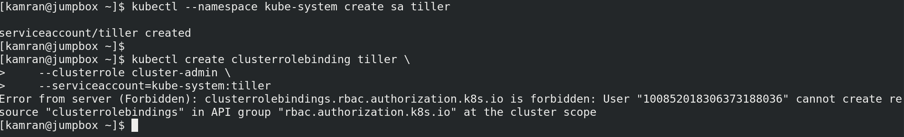
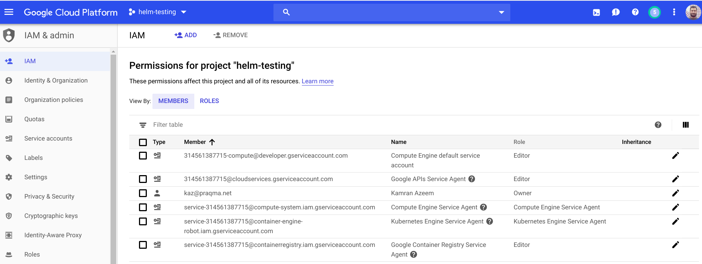
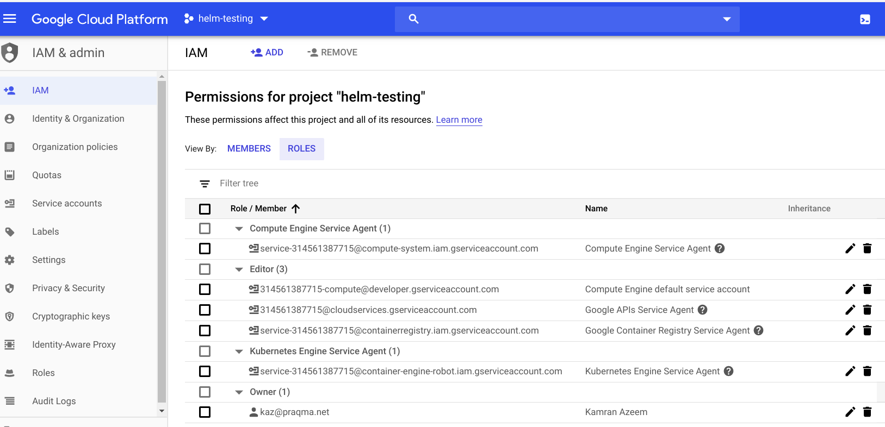

# The Kubernetes package manager - Helm

So far you have learned the following:
* how to create a deployment,
* how to expose that deployment as a service, 
* how to create secrets and configmaps,
* how to create persistent volumes (pv) and persistent volume claims (pvc)

Creating all of them by hand is possible but tedious. You could combine all of the above as single or multiple yaml files in a directory. But think that at one point, you may want to have two versions of this collection of yaml files. say, it is nginx you have deployed using a set of yaml files, and it is nginx version 1.7.9. Now you want another (test) deployment, with nginx version 1.9.5 - in a separate 'test' namespace. Are you going to edit all the files to reflect this change? or are you going to make a copy in a different directory and make changes over there? Then you have to maintain both copies! Welcome to copy/paste file-management hell! :) . 

Fear not! This can be completely avoided, by using a package manager - **Helm** in our case.

Helm allows you to package your application using a template system. The package is called a **chart** and created/stored as a single (`.tgz`) tarball. Then, you can deploy that package by (optionally) passing custom values to the package at the time of deployment. Helm maintains **releases** of the packages it deploys. This allows you to have full control over your applications, where they are being deployed, which values they use for various parameters, etc. 

The word "chart" brings up image of a treasure map in our minds, which is quite contrary to what the helm "package" really is! This confusion is caused by the community's obsession to name everything related to docker/kubernetes using some marine terminology - may it be a word from English, or Greek, or Spanish, etc. In this case they came up with the word *chart* - I don't know why! Anyhow, for the sake of clarity, a **chart** should be considered a **package**. This is similar to a software package in operating system, maintained by an operating system package manager, such as `rpm/yum`, `apt`, `brew`,  etc. 

## What is Helm?
(From: [https://helm.sh/docs/architecture/](https://helm.sh/docs/architecture/) )

Helm is a tool for managing Kubernetes packages called charts. Helm can do the following:
* Create new charts from scratch
* Package charts into chart archive (tgz) files
* Interact with chart repositories where charts are stored
* Install and uninstall charts into an existing Kubernetes cluster
* Manage the release cycle of charts that have been installed with Helm

Following are some important concepts:
* A chart is a bundle of information necessary to create an instance of a Kubernetes application.
* A config contains configuration information that can be merged into a packaged chart to create a releasable object.
* A release is a running instance of a chart, combined with a specific config.
* A helm chart is stored in a chart repository which can be any web server that can serve YAML and tar files and can answer HTTP GET requests. This means you can use a Google Cloud Storage (GCS) bucket, Amazon S3 bucket, Github Pages, nginx, apache, or even create your own web server!

## Client side installation:
So, you have a fresh kubernetes cluster and now you are ready to experiment with helm. The first thing you need is a **helm** client binary/program installed on your local/work computer.

If you previously installed helm on your local computer, you may want to upgrade it. First, check the version of helm on your machine:
```
[student@kworkhorse ~]$ helm version
Client: &version.Version{SemVer:"v2.7.2", GitCommit:"8478fb4fc723885b155c924d1c8c410b7a9444e6", GitTreeState:"clean"}
^C

[student@kworkhorse ~]$ which helm
/usr/local/bin/helm
[student@kworkhorse ~]$
```

If you see that helm is not already installed on your local/work computer, or, you want to upgrade it, proceed with the following steps.

Visit [https://github.com/helm/helm/releases](https://github.com/helm/helm/releases) , and download the latest version of helm (for your architecture). You will need to download it, untar the tarball, and then place the two binaries in a directory which is in the PATH.

```
[student@kworkhorse ~]$ curl -LO https://get.helm.sh/helm-v2.14.1-linux-amd64.tar.gz
  % Total    % Received % Xferd  Average Speed   Time    Time     Time  Current
                                 Dload  Upload   Total   Spent    Left  Speed
100 25.3M  100 25.3M    0     0  12.1M      0  0:00:02  0:00:02 --:--:-- 12.1M

[student@kworkhorse ~]$ tar xzf helm-v2.14.1-linux-amd64.tar.gz 

[student@kworkhorse ~]# sudo mv /home/student/linux-amd64/helm /usr/local/bin/
mv: overwrite '/usr/local/bin/helm'? y

[student@kworkhorse ~]# mv /home/student/linux-amd64/tiller /usr/local/bin/
```

Check the version of helm again:
```
[student@kworkhorse ~]$ helm version
Client: &version.Version{SemVer:"v2.14.1", GitCommit:"5270352a09c7e8b6e8c9593002a73535276507c0", GitTreeState:"clean"}
Error: could not find tiller
[student@kworkhorse ~]$
```

The error `Error: could not find tiller` is expected, as you have not configured tiller in your (fresh) cluster - yet.


## Server side installation:

Helm has a server side component called **tiller**. That needs to be created before you are able to use helm. Tiller is created as part of the `helm init` command further below. 

Just so you know, Helm will figure out where to install Tiller by reading your Kubernetes configuration file (usually `$HOME/.kube/config`). This is the same file that `kubectl` uses. You can always verify/find out which cluster Tiller would install to, by running `kubectl config current-context` or `kubectl cluster-info` commands. e.g:

```
[student@kworkhorse ~]$ kubectl config get-contexts
CURRENT   NAME                                                CLUSTER                                             AUTHINFO                                            NAMESPACE
*         gke_helm-testing-243416_europe-north1-a_helm-test   gke_helm-testing-243416_europe-north1-a_helm-test   gke_helm-testing-243416_europe-north1-a_helm-test   
[student@kworkhorse ~]$

[student@kworkhorse ~]$ kubectl config current-context
gke_helm-testing-243416_europe-north1-a_helm-test
[student@kworkhorse ~]$ 

[student@kworkhorse ~]$ kubectl cluster-info
Kubernetes master is running at https://35.228.56.22
GLBCDefaultBackend is running at https://35.228.56.22/api/v1/namespaces/kube-system/services/default-http-backend:http/proxy
Heapster is running at https://35.228.56.22/api/v1/namespaces/kube-system/services/heapster/proxy
KubeDNS is running at https://35.228.56.22/api/v1/namespaces/kube-system/services/kube-dns:dns/proxy
Metrics-server is running at https://35.228.56.22/api/v1/namespaces/kube-system/services/https:metrics-server:/proxy

To further debug and diagnose cluster problems, use 'kubectl cluster-info dump'.
[student@kworkhorse ~]$ 
```

### How much access to give to the tiller?
If you’re using Helm on a cluster that you completely control, like **minikube** or a cluster on a private network in which sharing is not a concern, the default installation – which applies no security configuration – is fine, and it’s definitely the easiest. To install Helm without additional security steps, install Helm and then [initialize Helm](https://helm.sh/docs/using_helm/#initialize-helm-and-install-tiller).
If your cluster has Role-Based Access Control (RBAC) enabled, (normally k8s 1.7+), you will need to configure a service account and rules before proceeding.
One way to install tiller is to allow it access to *entire cluster* (i.e. all namespaces) to deploy helm packages in any namespace throughout the cluster. Normally in such setup, tiller is deployed in the `kube-system` namespace. 

To get this done, follow the steps outlined at: [https://helm.sh/docs/using_helm/#role-based-access-control](https://helm.sh/docs/using_helm/#role-based-access-control). These steps are shown below:

First, create a file `rbac-config.yaml` :
```
[student@kworkhorse ~]$ vi rbac-config.yaml

apiVersion: v1
kind: ServiceAccount
metadata:
  name: tiller
  namespace: kube-system
---
apiVersion: rbac.authorization.k8s.io/v1
kind: ClusterRoleBinding
metadata:
  name: tiller
roleRef:
  apiGroup: rbac.authorization.k8s.io
  kind: ClusterRole
  name: cluster-admin
subjects:
  - kind: ServiceAccount
    name: tiller
    namespace: kube-system
```
**Note:** The cluster-admin role is created by default in a Kubernetes cluster, so you don’t have to define it explicitly.


Now, create create the two objects defined in the above file, using the command below:
```
[student@kworkhorse ~]$ kubectl create -f rbac-config.yaml 
serviceaccount/tiller created
clusterrolebinding.rbac.authorization.k8s.io/tiller created
[student@kworkhorse ~]$
```

**Notes:** 
* If at this point, you encounter errors, then you need to make sure that you authenticated correctly to the google cloud, using the gcloud command presented to you when you connected to the cluster for the first time. If there is a problem in that authentication, you will have problems in this step, and you will not be able to move forward.


* You should also make sure that the user id (the google id) you used to authenticate to the cluster has correct permissions in the IAM section of the google project this cluster is part of.
* A colleague of mine generously shared: In GCP we'd ideally create a new **Role** ... something like `docker-kubernetes-student` which is a copy of the "Kubernets Engine Developer" `roles/container.developer`, and then add (some or all of?) the permissions `container.clusterRoleBindings.*`, `container.clusterRoles.*`, `container.serviceAccounts.*`, `container.roleBindings.*`, `container.roles.*` to this Role, and create the GServiceAccount with this new Role. Also note that  `roles/container.developer` has all the `container.serviceAccounts.*` permissions. But is lacking the "create/update/delete" permissions on all the `*role*` permissions. 
* Based on above, I conclude that it is much better to use "Kubernets Engine Admin" role during training.
* Below are screeshots of IAM permissions which seems to work:




Ok, back to where we were. If the above (service account and role creation/binding) executed correctly ( as shown above 'Notes'), then it's time to `helm init` , which installs the **tiller** (in `kube-system` namespace), like so:

```
[student@kworkhorse ~]$ helm init --service-account tiller --history-max 200
$HELM_HOME has been configured at /home/student/.helm.

Tiller (the Helm server-side component) has been installed into your Kubernetes Cluster.

Please note: by default, Tiller is deployed with an insecure 'allow unauthenticated users' policy.
To prevent this, run `helm init` with the --tiller-tls-verify flag.
For more information on securing your installation see: https://docs.helm.sh/using_helm/#securing-your-helm-installation
[student@kworkhorse ~]$ 
```

**Notes:**
* If you want to install into a different cluster, Use the `--kube-context` flag.
* When you want to upgrade Tiller, just run `helm init --upgrade`.

At this point, you should verify that the tiller is running in the `kube-system` namespace - as a pod:

```
[student@kworkhorse ~]$ kubectl --namespace kube-system get pods
NAME                                                  READY   STATUS    RESTARTS   AGE
event-exporter-v0.2.4-5f7d5d7dd4-74szw                2/2     Running   0          36m
fluentd-gcp-scaler-7b895cbc89-r5f6c                   1/1     Running   0          36m
fluentd-gcp-v3.2.0-zqdw6                              2/2     Running   0          36m
heapster-v1.6.0-beta.1-856657b654-p6t2h               3/3     Running   0          36m
kube-dns-autoscaler-76fcd5f658-4ff4m                  1/1     Running   0          36m
kube-dns-b46cc9485-ffwj6                              4/4     Running   0          36m
kube-proxy-gke-helm-test-default-pool-67d838b0-8ckc   1/1     Running   0          36m
l7-default-backend-6f8697844f-nsg89                   1/1     Running   0          36m
metrics-server-v0.3.1-5b4d6d8d98-ll57z                2/2     Running   0          36m
prometheus-to-sd-bmpsn                                1/1     Running   0          36m
tiller-deploy-7c588f67fd-s44tv                        1/1     Running   0          6m13s
[student@kworkhorse ~]$ 
```

Notice the last line, which shows `tiller-deploy-xxxxxxx-xxxxx` running.

Now, you can try doing `helm ls`, which should not return anything, as this is a fresh cluster, and you have not deployed any helm packages/charts - yet.

```
[student@kworkhorse ~]$ helm ls
[student@kworkhorse ~]$ 
```

## Using Helm:
Now we need to  populate the Helm repositories, before using them:

```
[student@kworkhorse ~]$ helm repo update
Hang tight while we grab the latest from your chart repositories...
...Skip local chart repository
...Successfully got an update from the "stable" chart repository
Update Complete.
[student@kworkhorse ~]$ 
```

Now, if you run `helm repo list` , it will show you the list of repositories. 

```
[student@kworkhorse ~]$ helm repo list
NAME  	URL                                             
stable	https://kubernetes-charts.storage.googleapis.com
local 	http://127.0.0.1:8879/charts                    
[student@kworkhorse ~]$ 
```

Note: Running `helm ls` would still result in empty result, as you have still not deployed any helm packages/charts yet.

You can now search for the packages you which to install, using `helm search`:

```
[student@kworkhorse ~]$ helm search nginx
NAME                       	CHART VERSION	APP VERSION	DESCRIPTION                                                 
stable/nginx-ingress       	1.6.17       	0.24.1     	An nginx Ingress controller that uses ConfigMap to store ...
stable/nginx-ldapauth-proxy	0.1.2        	1.13.5     	nginx proxy with ldapauth                                   
stable/nginx-lego          	0.3.1        	           	Chart for nginx-ingress-controller and kube-lego            
stable/gcloud-endpoints    	0.1.2        	1          	DEPRECATED Develop, deploy, protect and monitor your APIs...
[student@kworkhorse ~]$

[student@kworkhorse ~]$ helm search mysql
NAME                            	CHART VERSION	APP VERSION	DESCRIPTION                                                 
stable/mysql                    	1.2.0        	5.7.14     	Fast, reliable, scalable, and easy to use open-source rel...
stable/mysqldump                	2.4.2        	2.4.1      	A Helm chart to help backup MySQL databases using mysqldump 
stable/prometheus-mysql-exporter	0.3.3        	v0.11.0    	A Helm chart for prometheus mysql exporter with cloudsqlp...
stable/percona                  	1.1.0        	5.7.17     	free, fully compatible, enhanced, open source drop-in rep...
stable/percona-xtradb-cluster   	1.0.0        	5.7.19     	free, fully compatible, enhanced, open source drop-in rep...
stable/phpmyadmin               	2.2.5        	4.9.0-1    	phpMyAdmin is an mysql administration frontend              
stable/gcloud-sqlproxy          	0.6.1        	1.11       	DEPRECATED Google Cloud SQL Proxy                           
stable/mariadb                  	6.4.3        	10.3.15    	Fast, reliable, scalable, and easy to use open-source rel...
[student@kworkhorse ~]$ 
```

Lets install a helm package/chart - say MySQL:

```
$ helm install stable/mysql
```

```
[student@kworkhorse ~]$ helm install stable/mysql
NAME:   funny-possum
E0611 21:21:53.564199    9713 portforward.go:372] error copying from remote stream to local connection: readfrom tcp4 127.0.0.1:41251->127.0.0.1:47386: write tcp4 127.0.0.1:41251->127.0.0.1:47386: write: broken pipe
LAST DEPLOYED: Tue Jun 11 21:21:51 2019
NAMESPACE: default
STATUS: DEPLOYED

RESOURCES:
==> v1/ConfigMap
NAME                     DATA  AGE
funny-possum-mysql-test  1     2s

==> v1/PersistentVolumeClaim
NAME                STATUS   VOLUME    CAPACITY  ACCESS MODES  STORAGECLASS  AGE
funny-possum-mysql  Pending  standard  2s

==> v1/Pod(related)
NAME                                 READY  STATUS   RESTARTS  AGE
funny-possum-mysql-868c9644f5-hr4sn  0/1    Pending  0         2s

==> v1/Secret
NAME                TYPE    DATA  AGE
funny-possum-mysql  Opaque  2     2s

==> v1/Service
NAME                TYPE       CLUSTER-IP     EXTERNAL-IP  PORT(S)   AGE
funny-possum-mysql  ClusterIP  10.27.253.207  <none>       3306/TCP  2s

==> v1beta1/Deployment
NAME                READY  UP-TO-DATE  AVAILABLE  AGE
funny-possum-mysql  0/1    1           0          2s


NOTES:
MySQL can be accessed via port 3306 on the following DNS name from within your cluster:
funny-possum-mysql.default.svc.cluster.local

To get your root password run:

    MYSQL_ROOT_PASSWORD=$(kubectl get secret --namespace default funny-possum-mysql -o jsonpath="{.data.mysql-root-password}" | base64 --decode; echo)

To connect to your database:

1. Run an Ubuntu pod that you can use as a client:

    kubectl run -i --tty ubuntu --image=ubuntu:16.04 --restart=Never -- bash -il

2. Install the mysql client:

    $ apt-get update && apt-get install mysql-client -y

3. Connect using the mysql cli, then provide your password:
    $ mysql -h funny-possum-mysql -p

To connect to your database directly from outside the K8s cluster:
    MYSQL_HOST=127.0.0.1
    MYSQL_PORT=3306

    # Execute the following command to route the connection:
    kubectl port-forward svc/funny-possum-mysql 3306

    mysql -h ${MYSQL_HOST} -P${MYSQL_PORT} -u root -p${MYSQL_ROOT_PASSWORD}
    

[student@kworkhorse ~]$ 
```

Check if it is actually installed:
```
[student@kworkhorse ~]$ helm ls
NAME        	REVISION	UPDATED                 	STATUS  	CHART      	APP VERSION	NAMESPACE
funny-possum	1       	Tue Jun 11 21:21:51 2019	DEPLOYED	mysql-1.2.0	5.7.14     	default  
[student@kworkhorse ~]$ 
```


```
[student@kworkhorse ~]$ kubectl get pods,deployment,service,secrets,configmap,pvc,pv
NAME                                      READY   STATUS    RESTARTS   AGE
pod/funny-possum-mysql-868c9644f5-hr4sn   1/1     Running   0          2m48s

NAME                                       DESIRED   CURRENT   UP-TO-DATE   AVAILABLE   AGE
deployment.extensions/funny-possum-mysql   1         1         1            1           2m49s

NAME                         TYPE        CLUSTER-IP      EXTERNAL-IP   PORT(S)    AGE
service/funny-possum-mysql   ClusterIP   10.27.253.207   <none>        3306/TCP   2m51s
service/kubernetes           ClusterIP   10.27.240.1     <none>        443/TCP    173m

NAME                         TYPE                                  DATA   AGE
secret/default-token-jk8bc   kubernetes.io/service-account-token   3      172m
secret/funny-possum-mysql    Opaque                                2      2m52s

NAME                                DATA   AGE
configmap/funny-possum-mysql-test   1      2m54s

NAME                                       STATUS   VOLUME                                     CAPACITY   ACCESS MODES   STORAGECLASS   AGE
persistentvolumeclaim/funny-possum-mysql   Bound    pvc-2a5275e8-8c7e-11e9-a21f-42010aa600eb   8Gi        RWO            standard       2m54s

NAME                                                        CAPACITY   ACCESS MODES   RECLAIM POLICY   STATUS   CLAIM                        STORAGECLASS   REASON   AGE
persistentvolume/pvc-2a5275e8-8c7e-11e9-a21f-42010aa600eb   8Gi        RWO            Delete           Bound    default/funny-possum-mysql   standard                2m51s
[student@kworkhorse ~]$ 
```


**Note:** MySQL helm package/chart is installed successfully , because this cluster had a (default) storage class available, and dynamic storage provisioning was enabled. If a (default) storage class does not exist on the cluster, mysql helm chart will not install correctly, as it will keep waiting (in pending state) for storage.

```
[student@kworkhorse ~]$ kubectl get storageclass
NAME                 PROVISIONER            AGE
standard (default)   kubernetes.io/gce-pd   174m
[student@kworkhorse ~]$ 
```
 
Last thing I want to show is that you can delete the helm chart (package) using `helm delete` command:

```
[student@kworkhorse ~]$ helm ls
NAME        	REVISION	UPDATED                 	STATUS  	CHART      	APP VERSION	NAMESPACE
funny-possum	1       	Tue Jun 11 21:21:51 2019	DEPLOYED	mysql-1.2.0	5.7.14     	default  

[student@kworkhorse ~]$ helm delete funny-possum --purge 
release "funny-possum" deleted

[student@kworkhorse ~]$ helm ls
[student@kworkhorse ~]$ 
```

As mentioned in the begnning of this page, the **charts** describe which values can be provided for overwriting default behavior. Normally, you would modify the `values.yaml` file to override the default values to match your requirements. 

Praqma has created [Helmsman](https://github.com/Praqma/Helmsman), which is another layer of abstraction on top of Helm. Helmsman allows you to deploy helm charts through CI/CD pipelines.

# Further reading:
* [Helm quick start guide](https://helm.sh/docs/using_helm/#quickstart)
* [Securing your helm installation](https://helm.sh/docs/using_helm/#securing-your-helm-installation)
* [How to create your own charts?](https://helm.sh/docs/developing_charts/)
