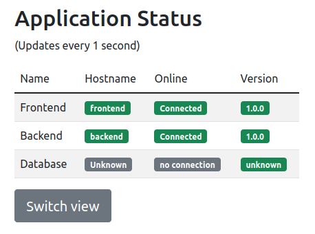

# Accessing your Application

## Learning Goals

- Ability to reach a pod inside the cluster from your local machine.
- By using `kubectl port-forward` to forward a local port to a port in a pod.
- Use environment variables to configure containers in pods.

## Introduction

Deploying a pod is not enough to make it accessible from outside the cluster.

In this exercise you will learn how to make temporary connections to a pod inside the cluster via `kubectl port-forward`.

## Port-forward

The `kubectl port-forward` command allows you to forward one or more local ports to a pod. This can be used to access a pod that is running in the cluster, using for example a web browser or a command line tool like `curl`.

The command takes two arguments: the pod name and the port to forward. The port is specified as `local:remote` to forward a local port to a remote port inside the pod.

For example, if you want to forward port 8080 on your local machine to port 5000 in the pod, you can use the following command:

`kubectl port-forward frontend 8080:5000`

You can then access the pod on `localhost:8080`.

<details>
<summary>:bulb: How does this port-forward work?</summary>

Port forwarding is a network address translation that redirects internet packets form one IP address with specified port number to another `IP:PORT` set.

In Kubernetes `port-forward` creates a tunnel between your local machine and Kubernetes cluster on the specified `IP:PORT` pairs in order to establish connection to the cluster. `kubectl port-forward` allows you to forward not only pods but also services, deployments and other.

More information can be found from [here](https://kubernetes.io/docs/tasks/access-application-cluster/port-forward-access-application-cluster/)

</details>

## Exercise

### Overview

- Deploy the frontend pod
- Expose the frontend with port-forward.
- Look at the frontend in a browser.
- Delete the frontend pod
- Deploy the backend pod
- Add environment variables to the frontend pod
- Expose the frontend with port-forward.
- Execute a curl command to the backend from the frontend pod

> :bulb: If you get stuck somewhere along the way, you can check the solution in the done folder.

### Step by step instructions

<details>
<summary>
Step by step:
</summary>

- Go into the `accessing-your-application` directory and the `start` folder.
- Deploy the frontend pod

<details>
<summary>
Hint on doing that
</summary>

You can use the `kubectl apply -f <filename>` command to deploy the pod.
The pod is defined in the `frontend-pod.yaml` file.

</details>

- Check that the pod is running with `kubectl get pods` command.

You should see something like this:

```
NAME       READY   STATUS    RESTARTS   AGE
frontend   1/1     Running   0          2m
```

- Expose the frontend with port-forward

Port forward can be achieved with:

`kubectl port-forward --address 0.0.0.0 frontend 8080:5000`

> :bulb: We add the `--address 0.0.0.0` option to the port-forward command to make it accept commands coming from remote machines, like your laptop!
> `0.0.0.0` Means any address, so you probably don't want to do this on your own machine in, unless you want to expose something to the internet.

And can then be accessed on `inst<number>.<prefix>.eficode.academy:8080` (from the internet).

> :bulb: VSCode will ask you if you what to see the open port. Unfortunately vscode proxy does not proxy requests correctly back to the pod, so use the URL of the instance instead.

- Look at it in the browser.

Now we will deploy both the frontend and backend pods.

- Stop the port-forward process by pressing `Ctrl-c` in the terminal.
- Delete the frontend pod with `kubectl delete pod frontend` command.
- Deploy the backend pod with `kubectl apply -f backend-pod.yaml` command.
- Check that the pod is running, and note down the IP with `kubectl get pods -o wide` command.

You should see something like this:

```
k get pods backend -o wide
NAME      READY   STATUS    RESTARTS   AGE   IP            NODE                                        NOMINATED NODE   READINESS GATES
backend   1/1     Running   0          11s   10.0.40.196   ip-10-0-35-102.eu-west-1.compute.internal   <none>           <none>
```

In this case the IP is `10.0.40.196`, but it will be different in your case.

**Add environment variables to the frontend pod**

- Open the `frontend-pod.yaml` file and add the following environment variables to the pod:

```yaml
env:
  - name: BACKEND_HOST
    value: "10.0.40.196" # Use the IP address you noted down above
  - name: BACKEND_PORT
    value: "5000"
```

The `env` key is part of the `spec.containers[0]`:

```yaml
apiVersion: v1
kind: Pod
metadata:
  name: frontend
spec:
  containers:
    - name: frontend
      image: ghcr.io/eficode-academy/quotes-flask-frontend:0c8adaa4fe8a40fe703cdda414a8f191f4966fc4
      ports:
        - containerPort: 5000
      # <put env: here!>
```

<details>
<summary>
Help me! (solution)
</summary>

```yaml
apiVersion: v1
kind: Pod
metadata:
  name: frontend
spec:
  containers:
    - name: frontend
      image: ghcr.io/eficode-academy/quotes-flask-frontend:0c8adaa4fe8a40fe703cdda414a8f191f4966fc4
      ports:
        - containerPort: 5000
      env:
        - name: BACKEND_HOST
          value: "10.0.40.196"
        - name: BACKEND_PORT
          value: "5000"
```

</details>

- Deploy the frontend pod with `kubectl apply -f frontend-pod.yaml` command.

- Check that the pod is running with `kubectl get pods` command.

- Forward a local port to the pod using `kubectl port-forward`.

- Visit the frontend in the browser.

You should see something like this:



(if you don't you might need to refresh the page)

- Exec into the frontend pod with `kubectl exec -it frontend -- /bin/sh` command.

- Execute a curl command to the backend `curl http://<BACKEND_IP>:5000`.

### Extra

<details>
<summary>
Extra exercise
</summary>

While still having the port-forward running

- Access the frontend in the browser and check that it still works and that frontend has access to the backend.
- Try to delete the backend pod with `kubectl delete pod backend` command.
- Try to recreate the backend pod with `kubectl apply -f backend-pod.yaml` command.
- Access the frontend in the browser.
- Does it still have access to the backend?

If not, why not?

<details>
<summary>Solution</summary>

The frontend pod is not configured to automatically re-resolve the backend IP address.
So when we deleted the pod, and recreated it, the IP address changed, but the frontend pod still has the old IP address in its environment variables.

Thankfully Kubernetes has a networking abstraction called `services` which solves this exact (and more!) problem, which we will learn about in the next exercise.

</details>
</details>
</details>

### Clean up

- Stop the port-forward with `Ctrl+C` command.
- Delete the pod with `kubectl delete pod frontend` command.
- Delete the pod with `kubectl delete pod backend` command.

Congratulations! You have now learned how to make temporary connections to a pod inside the cluster via `kubectl port-forward`, and how to use environment variables to configure the pod.
And lastly, you have learned how to use `kubectl exec` to execute commands inside a pod.
