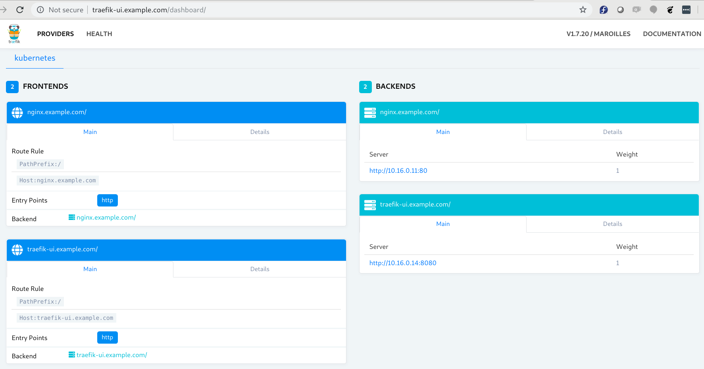

**Note:** This is part one of the three-part tutorial, where each part is completely independent of each other. For learning though, the following sequence is advised:

* [https://github.com/KamranAzeem/kubernetes-katas/tree/master/ingress-traefik/basic-setup-without-https](https://github.com/KamranAzeem/kubernetes-katas/tree/master/ingress-traefik/basic-setup-without-https)
* [https://github.com/KamranAzeem/kubernetes-katas/tree/master/ingress-traefik/https-letsencrypt-HTTP-Challenge](https://github.com/KamranAzeem/kubernetes-katas/tree/master/ingress-traefik/https-letsencrypt-HTTP-Challenge)
* [https://github.com/KamranAzeem/kubernetes-katas/tree/master/ingress-traefik/https-letsencrypt-DNS-Challenge](https://github.com/KamranAzeem/kubernetes-katas/tree/master/ingress-traefik/https-letsencrypt-DNS-Challenge)


Also, if you are interested in learning the basics of LetsEncrypt, then the following might prove useful:
* [https://github.com/KamranAzeem/learn-letsencrypt](https://github.com/KamranAzeem/learn-letsencrypt)

# Start by setting up some services you would like to access from outside:

## Create nginx.example.com 
The following creates a service on port 80, with ingress set to nginx.example.com

```
$ kubectl apply -f nginx.example.com.yaml 
deployment.extensions/nginx created
service/nginx created
ingress.extensions/nginx-example-com created
```

## Create apache.example.com 
This creates a service on port 80, with ingress set to apache.example.com


## Create tomcat.example.com 
This creates a service on port 8080, with ingress set to tomcat.example.com

# Setup Traefik (v 1.7) ingress controller on the cluster: 
Follow this guide: [https://docs.traefik.io/v1.7/user-guide/kubernetes/](https://docs.traefik.io/v1.7/user-guide/kubernetes/)


## Setup Role Based Access Control configuration:
```
$ wget https://raw.githubusercontent.com/KamranAzeem/kubernetes-katas/master/ingress-traefik/traefik-rbac.yaml
```

```
$ kubectl apply -f traefik-rbac.yaml
clusterrole.rbac.authorization.k8s.io/traefik-ingress-controller created
clusterrolebinding.rbac.authorization.k8s.io/traefik-ingress-controller created
```


## Deploy Traefik using a Deployment

```
$ wget https://raw.githubusercontent.com/KamranAzeem/kubernetes-katas/master/ingress-traefik/traefik-deployment.yaml
```

```
$ kubectl apply -f traefik-deployment.yaml
serviceaccount/traefik-ingress-controller created
deployment.extensions/traefik-ingress-controller created
service/traefik-ingress-service created
```


**Note:** Make sure to use **TCP** instead of **tcp**, otherwise you get the following error:

```
$ kubectl apply -f traefik-deployment.yaml
serviceaccount/traefik-ingress-controller created
deployment.extensions/traefik-ingress-controller created
The Service "traefik-ingress-service" is invalid: 
* spec.ports[0].protocol: Unsupported value: "tcp": supported values: "SCTP", "TCP", "UDP"
* spec.ports[1].protocol: Unsupported value: "tcp": supported values: "SCTP", "TCP", "UDP"
* spec.ports[2].protocol: Unsupported value: "tcp": supported values: "SCTP", "TCP", "UDP"
* spec.ports[0].protocol: Invalid value: "tcp": cannot create an external load balancer with non-TCP/UDP/SCTP ports
* spec.ports[1].protocol: Invalid value: "tcp": cannot create an external load balancer with non-TCP/UDP/SCTP ports
* spec.ports[2].protocol: Invalid value: "tcp": cannot create an external load balancer with non-TCP/UDP/SCTP ports
```


## Check if Traefik pods are up and running:
```
$ kubectl get namespaces
NAME          STATUS   AGE
default       Active   22m
kube-public   Active   22m
kube-system   Active   22m
```

```
$ kubectl get pods --namespace=kube-system
NAME                                                             READY   STATUS    RESTARTS   AGE
event-exporter-v0.2.4-5f88c66fb7-mkvfz                           2/2     Running   0          22m
fluentd-gcp-scaler-59b7b75cd7-pnhvs                              1/1     Running   0          22m
fluentd-gcp-v3.2.0-vfj8k                                         2/2     Running   0          22m
heapster-78f6769798-b2cvv                                        3/3     Running   0          21m
kube-dns-79868f54c5-dmh89                                        4/4     Running   0          22m
kube-dns-autoscaler-bb58c6784-7r488                              1/1     Running   0          22m
kube-proxy-gke-ingress-demo-cluster-default-pool-22891e8f-nl2x   1/1     Running   0          22m
l7-default-backend-fd59995cd-7qb4g                               1/1     Running   0          22m
metrics-server-v0.3.1-57c75779f-khh6k                            2/2     Running   0          22m
prometheus-to-sd-ww2m9                                           2/2     Running   0          22m
traefik-ingress-controller-6b4d8f6668-5f55p                      1/1     Running   0          101s    <------ This one.
```

## Check the Traefik service:
Traefik ingress controller should be setup as a LoadBalancer. Make a note of it's EXTERNAL-IP.
```
$ kubectl --namespace=kube-system get services
NAME                      TYPE           CLUSTER-IP   EXTERNAL-IP     PORT(S)                                     AGE
default-http-backend      NodePort       10.0.3.237   <none>          80:30627/TCP                                24m
heapster                  ClusterIP      10.0.5.146   <none>          80/TCP                                      24m
kube-dns                  ClusterIP      10.0.0.10    <none>          53/UDP,53/TCP                               24m
metrics-server            ClusterIP      10.0.3.162   <none>          443/TCP                                     24m
traefik-ingress-service   LoadBalancer   10.0.4.80    35.188.115.48   80:31734/TCP,443:32395/TCP,8080:31188/TCP   3m57s  <---- This one.
```

## Setup temporary name resolution on your computer (/etc/hosts):
At this point, it would be good to setup temporary name resolution on your local computer. Point all the test FQDNs to the EXTERNAL-IP from the output shown above.

```
# vi /etc/hosts
127.0.0.1  localhost localhost.localdomain
35.188.115.48   traefik-ui.example.com nginx.example.com apache.example.com tomcat.example.com
```

## Test if you can access your nginx.example.com deployment from your local computer:
To be really sure, first find the nginx pod, and watch it's logs:

```
$ kubectl get pods
NAME                     READY   STATUS    RESTARTS   AGE
nginx-55f54b58dd-4rn8f   1/1     Running   0          24m
```

```
$ kubectl logs -f nginx-55f54b58dd-4rn8f 

(nothing yet)
```

Now, run a curl from your local computer against the FQDN you setup for `nginx.example.com`:
```
$ curl nginx.example.com
<html>
<head>
<title>Welcome to nginx!</title>
. . . 
</head>
<body>
<h1>Welcome to nginx!</h1>
. . . 
</body>
</html>
```

Check if the nginx pod shows any activity in logs:
```
$ kubectl logs -f nginx-55f54b58dd-4rn8f 
10.16.0.14 - - [02/Feb/2020:02:25:52 +0000] "GET / HTTP/1.1" 200 612 "-" "curl/7.61.1" "10.16.0.1"
```

Hurray! You can reach your (nginx) service from outside the cluster!


## Setup Traefik Web-UI / Dashboard:
This will help us reach the traefik web UI , where we can look at Traefik's health, and the front-ends and back-ends for various ingresses it handles. 
**Note:** This is a basic implementation, and the Traefik dashboard will not be served on HTTPS, nor it will provide any authentication at the moment. These  can be configured later. Check this: [https://docs.traefik.io/v1.7/user-guide/kubernetes/](https://docs.traefik.io/v1.7/user-guide/kubernetes/)

```
$ kubectl apply -f traefik-webui-ingress.yaml
service/traefik-web-ui created
ingress.extensions/traefik-web-ui created
```

Use a browser to look at the web-ui. You should be able to see the `nginx.example.com` and `traefik-ui.example.com` front-ends and their related back-ends.



# Create more services:
Lets create a deployment for Tomcat, which listens on port 8080. Lets see if it can be handled correctly by Traefik , and that we can access it through `tomcat.example.com` without using port 8080.

```
$ kubectl apply -f tomcat.example.com.yaml
deployment.extensions/tomcat created
service/tomcat created
ingress.extensions/tomcat-example-com created
```

Check if the tomcat pods are running:
```
$ kubectl get pods
NAME                      READY   STATUS    RESTARTS   AGE
nginx-55f54b58dd-4rn8f    1/1     Running   0          47m
tomcat-69d8476668-68bq2   1/1     Running   0          36s
```

Tomcat should now pop up on our Traefik dashboard / web-ui too:


Lets watch Tomcat's logs, and try to access it from outside the cluster:
```
$ kubectl logs -f tomcat-69d8476668-68bq2 
. . . 
02-Feb-2020 02:49:58.205 INFO [main] org.apache.catalina.core.StandardService.startInternal Starting service [Catalina]
02-Feb-2020 02:49:58.210 INFO [main] org.apache.catalina.core.StandardEngine.startInternal Starting Servlet Engine: Apache Tomcat/8.5.50
02-Feb-2020 02:49:58.237 INFO [main] org.apache.coyote.AbstractProtocol.start Starting ProtocolHandler ["http-nio-8080"]
02-Feb-2020 02:49:58.273 INFO [main] org.apache.coyote.AbstractProtocol.start Starting ProtocolHandler ["ajp-nio-8009"]
02-Feb-2020 02:49:58.298 INFO [main] org.apache.catalina.startup.Catalina.start Server startup in 151 ms
. . . 
```

Access `tomcat.example.com` from our local computer:
```
$ curl tomcat.example.com
<!doctype html><html lang="en"><head><title>HTTP Status 404 – Not Found</title><style type="text/css">body {font-family:Tahoma,Arial,sans-serif;} h1, h2, h3, b {color:white;background-color:#525D76;} h1 {font-size:22px;} h2 {font-size:16px;} h3 {font-size:14px;} p {font-size:12px;} a {color:black;} .line {height:1px;background-color:#525D76;border:none;}</style></head><body><h1>HTTP Status 404 – Not Found</h1><hr class="line" /><p><b>Type</b> Status Report</p><p><b>Message</b> Not found</p><p><b>Description</b> The origin server did not find a current representation for the target resource or is not willing to disclose that one exists.</p><hr class="line" /><h3>Apache Tomcat/8.5.50</h3></body></html>
```

The output above, seems garbage - okay, it is - but it is actually Tomcat's reply, denying access to non-existent web content. Since we did not provide any java applications or JAR files to Tomcat, it is not serving any content yet.

Here is the screenshot of the same error:


Congratulations! You have setup Traefik correctly as a reverse proxy for your services running in Kubernetes.


