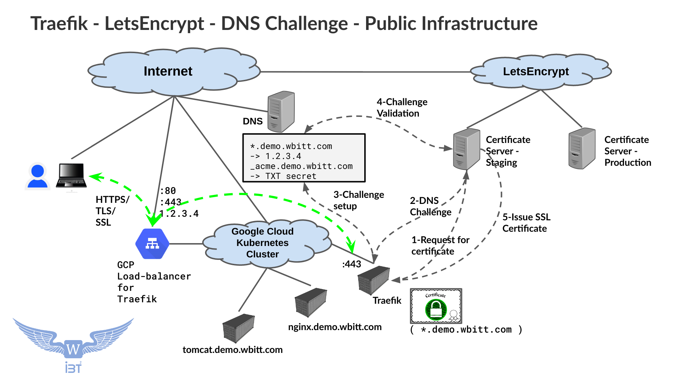
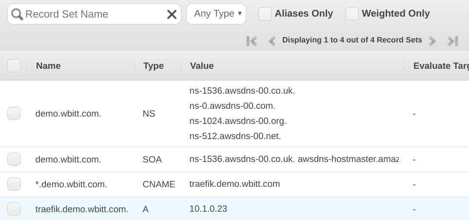
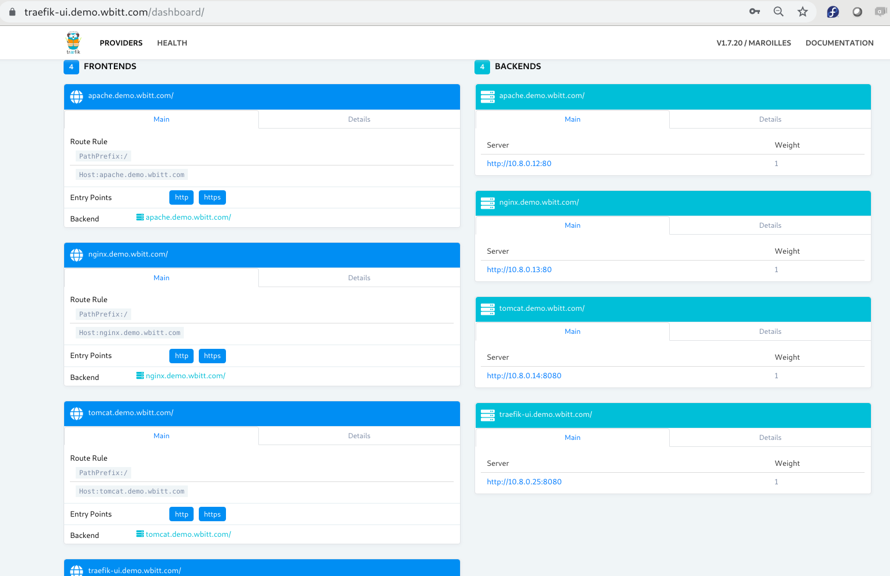

**Note:** This is part three of the three-part tutorial, where each part is completely independent of each other. For learning though, the following sequence is advised:

* [https://github.com/KamranAzeem/kubernetes-katas/tree/master/ingress-traefik/basic-setup-without-https](https://github.com/KamranAzeem/kubernetes-katas/tree/master/ingress-traefik/basic-setup-without-https)
* [https://github.com/KamranAzeem/kubernetes-katas/tree/master/ingress-traefik/https-letsencrypt-HTTP-Challenge](https://github.com/KamranAzeem/kubernetes-katas/tree/master/ingress-traefik/https-letsencrypt-HTTP-Challenge)
* [https://github.com/KamranAzeem/kubernetes-katas/tree/master/ingress-traefik/https-letsencrypt-DNS-Challenge](https://github.com/KamranAzeem/kubernetes-katas/tree/master/ingress-traefik/https-letsencrypt-DNS-Challenge)


Also, if you are interested in learning the basics of LetsEncrypt, then the following might prove useful:
* [https://github.com/KamranAzeem/learn-letsencrypt](https://github.com/KamranAzeem/learn-letsencrypt)


# Setup Traefik with HTTPS through LetsEncrypt - using "DNS Challenge": 
(**Infrastructure on Public Internet**)

DNS challenge is the only method to obtain wildcard SSL certificates. i.e. Single SSL certificate for `*.demo.wbitt.com`. That is the idea in this example/guide. DNS Challenge is also the only solution, if you want to obtain SSL certificates for your services running inside a private network. (More on this later).

For this setup, you must own/have-access-to a public DNS domain name and it's related DNS server. The DNS server must be reachable over the internet both by your web-server/reverse-proxy and also by LetsEncrypt. Technically LetsEncrypt does not need direct access to your DNS server. It just needs to be able to query your DNS domain, for certain (TXT) record; and, that is only possible if your DNS server is available on public internet. 

The host records, (DNS names of your services) in your DNS server do not necessarily need to have public IP addresses. It is ok if they have, such as the web-server/reverse-proxy server (Traefik in this case) being on the public internet itself. However, if the host records of your services do not exist in your DNS zone, it will still work for DNS Challenge. Why? Because the way DNS challenge works! It is explained in the next section.

You also need credentials and permissions to modify the DNS zone through an API. This means, your DNS provider must be supported by LetsEncrypt client program (Traefik in our case).

**Note:** As a bonus, we will also setup Basic Authentication for the Traefik API and Web-UI. :)

In this example, I have used the domain-name `demo.wbitt.com` (hosted in AWS (Route53)), and want to obtain a wild-card SSL certificate against that domain, so I can use it for `*.demo.wbitt.com` host-names/services. The DNS names (DNS records) for various services defined in this DNS zone are: 

```
apache.demo.wbitt.com.   IN  CNAME   traefik.demo.wbitt.com
nginx.demo.wbitt.com.    IN  CNAME   traefik.demo.wbitt.com
tomcat.demo.wbitt.com.   IN  CNAME   traefik.demo.wbitt.com
traefik.demo.wbitt.com.  IN  A       1.2.3.4
```

You can also have DNS setup as:
```
*.demo.wbitt.com.        IN  CNAME   traefik.demo.wbitt.com
traefik.demo.wbitt.com.  IN  A       1.2.3.4
```

Interestingly, even if you have absolutely nothing in your DNS zone file, the DNS challenge will still work. (You need the basic SOA and NS entries anyway). So if your DNS zone does not have any of the above entries, and is just empty, as shown in the screenshot below. DNS challenge will work. 

|  |
| ----------------------------------------- |
| Empty DNS zone |


However, if you have your infrastructure on a public cloud , then naturally you will have some host entries in the DNS zone file for the services you want to reach, including the reverse proxy's IP address .

|  |
| ------------------------------------------------------------------------------------- |
| DNS zone with a wild-card entry |


(Of-course `1.2.3.4` is a fake public IP I have used in the example above. We will get the actual at a later point)


For the setup discussed in this guide, our infrastructure is on public internet - Google Cloud.


## Little about LetsEncryptDNS Challenges:
A picture is worth a thousand words, so here is a useful diagram for you!

|  |
| ----------------------------------------------------------------------------------------------------- |

LetsEncrypt has two main methods of verifying that you/your-server/service is what you/your-server claims to be. One is HTTP (actually HTTP-01) Challenge, and the other is DNS (actually DNS-01) Challenge. In this article/guide, I have used DNS Challenge.


### DNS Challenge:
When using the DNS challenge, the following sequence of events happen:

0. Traefik is configured to request wild-card SSL certificates for the services/ingresses using a common DNS domain, e.g. `demo.wbitt.com`.
1. Traefik starts and sends a SSL certificate request to LetsEncrypt.
2. LetsEncrypt sends a DNS challenge back to Treafik. This means that Traefik has to setup a temporary TXT record in the domain's DNS zone file, and fill it with the challenge/secret given by LetsEncrypt. This means the TXT record will look like this: `_acme-challenge.demo.wbitt.com  IN TXT   <SECRET/TOKEN>`.
3. Traefik talks to the DNS server, using the credentials you already provided in Traefik's configuration; sets up the DNS challenge, and informs LetsEncrypt that the challenge is ready for verification.
4. Lets encrypt queries the DNS server belonging to the domain in question `demo.wbitt.com`, for the TXT record.
5. If LetsEncrypt finds a match, the challenge is verified and LetsEncrypt issues a wild-card certificate for that domain, which Traefik stores in the certificate store file `acme.json` . 
6. Traefik deletes the temporary TXT record in the domain's DNS zone file.

Now, if you start a service/ingress in the cluster, and it's host definition (`nginx.demo.wbitt.com`)  matches the domain `demo.wbitt.com`, then Traefik uses this wild-card certificate for it's HTTPS endpoint. 

**Note:** If the host definition (`www.somedomain.tld`) does not match the certificate, *and* there is no individually fetched certificate available for this service, then traefik serves a (invalid/self-signed) **"Default Traefik Certificate"** for it's HTTPS endpoint.


For example your DNS zone file can look like this:

```
*.demo.wbitt.com        IN  CNAME   traefik.demo.wbitt.com
traefik.demo.wbitt.com  IN  A       1.2.3.4
```

**Note:** You will not know the IP of Traefik loadbalancer, until you create Traefik's deployment and service. You will have to wait to make this last `A` record entry in the DNS zone until Traefik deployment/service is up and gets an external IP for it's load balancer.


## Small note about two types of certificates, and certificate servers:
* LetsEncrypt provides you with a **"Fake LE Root X1"** certificate if you use it's **"staging"** server for certificate issuance. This is a proper SSL certificate, only not **valid**, which is good for testing. 
* If you use the LetsEncrypt's **"production"** server, you will get a proper/valid SSL certificate issued by **"Let's Encrypt Authority X3"**. 
* Both type of certificates are valid only for 90 days.
* For Staging server, there is a Failed Validation limit of 60 failures per account, per hostname, per hour.
* For Production server, there is a Failed Validation limit of 5 failures per account, per hostname, per hour.

More about LetsEncrypt challenge types, here: [https://letsencrypt.org/docs/challenge-types/](https://letsencrypt.org/docs/challenge-types/)


## A very special use case for empty DNS zone:
A completely empty DNS zone file has a special use-case. That is, if your services run inside on some completely private infrastructure, using private non-route-able IPs, and none of the services (including the reverse proxy ) are accessible from outside, and you have an internal private DNS , which resolves the names of your services to private IP addresses, then it does not make any sense to make any entries in the DNS zone file. While talking about the same use-case, you have a need to use valid SSL certificates for all the services running on your private network. How to you solve this? That is where DNS-Challenge comes in handy. In such situation, you will have two DNS servers serving the exact same domain, say `demo.wbitt.com`. One DNS server will be publicly available, and will be completely empty (if you wish so). The other DNS server will be the private DNS server running inside your private network, inaccessible from outside. Even your Traefik reverse proxy is inside the private network. But when you employ DNS challenge, Traefik will contact LetsEncrypt for SSL certificates, which will ask Traefik to fulfill a challenge. Traefik will attempt to fulfill that challenge by updating the public DNS server for the same domain, and will inform LetsEncrypt to verify. LetsEncrypt will verify that a certain TXT record exists within this domain's DNS zone, and issues SSL certificates to Traefik. Traefik will store the certificates and will serve them to all the internal requests coming for backend services, on HTTPS. Since the certificates will be valid certificates, and "will match" the FQDN of the services in the private network, none of the services will have SSL errors.


|  |
| ----------------------------------------- |
| Completely empty DNS zone - Public |


|  |
| ----------------------------------------- |
| DNS zone - Private |


This topic will be covered in future, in a separate article.


# Setup Traefik 1.7:

## Setup the prerequisites:

This setup of Traefik is a bit different from the previous setup, which involved HTTP challenge. For Traefik to work with LetsEncrypt, and to fetch and serve the certificates, it needs few more components to be setup. Lets identify what it needs:

* A custom `traefik.toml` file, which would contain configuration section for HTTPS, entrypoints, LetsEncrypt, and Basic Auth for Web-UI.
* Credentials required to talk to and modify DNS zone entries for your domain (`demo.wbitt.com`). In case of AWS's Route 53, these are certain environment variables, (`AWS_*`), mentioned below.
* A place to store `acme.json` file , which will hold the SSL certificates obtained from LetsEncrypt.
* A `dashboard-users.htpasswd` file, which contains usernames and passwords for the web-ui.

In Kubernetes terms this means: 
* the `traefik.toml` file will be setup as a `configmap`
* the `AWS_*` environment variables will be setup as `secret`
* the `acme.json` file will be stored in a `persistent storage volume` - using a PVC
* the `dashboard-users.htpasswd` file will be setup as a `secret`

AWS Route53 specific environment variables:
* `AWS_ACCESS_KEY_ID: 'AKIAJSNVTLH43A2Q'`
* `AWS_SECRET_ACCESS_KEY: 'uC2QCpfDBUEWGG4L4693Hltm0HZchbb83'`
* `AWS_HOSTED_ZONE_ID: 'Z1SVJKHSFGHRL7'`
* `AWS_DEFAULT_REGION: 'eu-central-1'`


Trafik is deployed in the `kube-system` namespace. Therefore, it is important to note, that **all these items should be created in the `kube-system` namespace**, so the Traefik deployment is able to access these objects.

We need to modify the `traefik-deployment.yaml` file, and add the components listed above before we set it up. These (updated) files are part of this directory. For brevity, only relevant sections are copied below.


### Ensure that the AWS credentials actually work:
It is a good idea to first test the AWS credentials that you have. A very brief test would be to export the environment variables on your local computer terminal and use the `aws` cli command to list route53 hosted zones. If it works, then you are good.

```
$ export AWS_ACCESS_KEY_ID=AKIAJSNVTLH43A2Q

$ export AWS_SECRET_ACCESS_KEY=uC2QCpfDBUEWGG4L4693Hltm0HZchbb83

$ aws route53 list-hosted-zones
HOSTEDZONES	52DC4776-B6FA-D97F-8A7F-4A4CF965169A	/hostedzone/Z1SVJKHSFGHRL7	      demo.wbitt.com.	4
CONFIG	a subdomain for demo purpose	False

. . . 
(rest of DNS zones list)
```


### Modify/update `traefik.toml` file:

```
$ cat traefik.toml

defaultEntryPoints = ["http", "https"]
logLevel = "INFO"
[kubernetes]
  exposedByDefault = false
[api]
  dashboard = true
  entrypoint = "dashboard"
[entryPoints]
  [entryPoints.http]
  address = ":80"
    [entryPoints.http.redirect]
    entryPoint = "https"
  [entryPoints.https]
  address = ":443"
    [entryPoints.https.tls]
  [entryPoints.dashboard]
  address = ":8080"
    [entryPoints.dashboard.auth.basic]
    usersFile = "/secrets/dashboard-users.htpasswd"
[acme]
email = "someone@somewhere.tld"
storage = "/acme/acme.json"
entryPoint = "https"
caServer = "https://acme-staging-v02.api.letsencrypt.org/directory"
  [acme.dnsChallenge]
  provider = "route53"
  delayBeforeCheck = 0

  [[acme.domains]]
  main = "*.demo.wbitt.com"
```

**Note:**  Please make sure to change the email address in `traefik.toml` to a valid email address, else you will get the following errors in Traefik logs:
```
time="2020-02-06T20:48:52Z" level=info msg=Register...
time="2020-02-06T20:48:53Z" level=error msg="Unable to obtain ACME certificate for domains \"nginx.demo.wbitt.com\" detected thanks to rule \"Host:nginx.demo.wbitt.com\" : cannot get ACME client acme: error: 400 :: POST :: https://acme-staging-v02.api.letsencrypt.org/acme/new-acct :: urn:ietf:params:acme:error:invalidEmail :: Error creating new account :: contact email \"someone@somewhere.tld\" has invalid domain : Domain name does not end with a valid public suffix (TLD), url: "
```

**Note:** In the `traefik.toml` file above, we have enabled the LetsEncrypt's **"staging"** certificate server. This is intentional. During configuration, (especially while learning, or during first time setup), things can go wrong, and we don't want to be blocked by LetsEncrypt if we have any problems in our setup. Using "staging" is safe, (actually, highly recommended), because it has higher failure limit. That means you have a lot of room for error during the SSL setup , including name resolution problems or connectivity issues. We will change it to **"production"** once everything is working as expected.


### Modify/update `traefik-deployment.yaml` file:

```
$ cat traefik-deployment.yaml
 # Add PVC for storing `acme.json` file
apiVersion: v1
kind: PersistentVolumeClaim
metadata:
  namespace: kube-system
  name: pvc-traefik-acme-json
  labels:
    name: pvc-traefik-acme-json
spec:
  storageClassName: "standard"
  accessModes:
    - ReadWriteOnce
  resources:
    requests:
      storage: 100Mi

------
 # Add Environment Variables, Volumes and VolumeMounts
kind: Deployment
apiVersion: extensions/v1beta1
metadata:
  name: traefik-ingress-controller
  namespace: kube-system
  labels:
    k8s-app: traefik-ingress-controller
spec:
  replicas: 1
  selector:
    matchLabels:
      k8s-app: traefik-ingress-controller
  template:
    metadata:
      labels:
        k8s-app: traefik-ingress-controller
        name: traefik-ingress-controller
    spec:
      serviceAccountName: traefik-ingress-controller
      terminationGracePeriodSeconds: 60
      volumes:
      - name: vol-traefik-toml-file
        configMap:
          name: configmap-traefik-toml
      - name: vol-acme-json-file
        persistentVolumeClaim:
          claimName: pvc-traefik-acme-json
      - name: vol-dashboard-users-file
        secret:
          secretName: secret-traefik-dashboard-users
      containers:
      - image: traefik:1.7
        name: traefik-ingress-controller
        ports:
        - name: http
          containerPort: 80
        - name: https
          containerPort: 443
        - name: webui
          containerPort: 8080
        env:
          - name: AWS_ACCESS_KEY_ID
            valueFrom:
              secretKeyRef:
                name: secret-aws-dns-credentials
                key: AWS_ACCESS_KEY_ID
          - name: AWS_SECRET_ACCESS_KEY
            valueFrom:
              secretKeyRef:
                name: secret-aws-dns-credentials
                key: AWS_SECRET_ACCESS_KEY
          - name: AWS_HOSTED_ZONE_ID
            valueFrom:
              secretKeyRef:
                name: secret-aws-dns-credentials
                key: AWS_HOSTED_ZONE_ID
          - name: AWS_DEFAULT_REGION
            valueFrom:
              secretKeyRef:
                name: secret-aws-dns-credentials
                key: AWS_DEFAULT_REGION
        volumeMounts:
        - mountPath: "/etc/traefik/"
          name: vol-traefik-toml-file
        - mountPath: "/acme/"
          name: vol-acme-json-file
        - mountPath: "/secrets/"
          name: vol-dashboard-users-file

---- 
. . . 
(rest of the file)
```


### Create a configmap for `traefik.toml`:

```
$ kubectl  --namespace=kube-system  create configmap configmap-traefik-toml --from-file=traefik.toml
configmap/configmap-traefik-toml created
```


### Create a secret for AWS DNS credentials:
```
$ kubectl --namespace=kube-system create secret generic secret-aws-dns-credentials \
  --from-literal=AWS_ACCESS_KEY_ID=AKIAJSNVTLH43A2Q \
  --from-literal=AWS_SECRET_ACCESS_KEY=uC2QCpfDBUEWGG4L4693Hltm0HZchbb83 \
  --from-literal=AWS_HOSTED_ZONE_ID=Z1SVJKHSFGHRL7 \
  --from-literal=AWS_DEFAULT_REGION=eu-central-1
```


### Create a secret for Traefik's dashboard users:
First, create the password file, using the `htpasswd` utility on your local computer. If you don't have that on your local computer, there are many online (web-based) tools, which will create this file for you.

```
$ htpasswd -c -b dashboard-users.htpasswd admin secretpassword
Adding password for user admin
```

* The file name is: `dashboard-users.htpasswd`
* User: `admin`
* Password: `secretpassword`


**Notes:** 
* Default hashing algorithm used by htpasswd for password encryption is MD5.
* Traefik 1.7 does not support SHA-512 and SHA-256 hashes for passwords (the -5 and -2 switch on htpasswd command). If you create a password using these hashes, you will not be able to login to the dashboard. Only MD5 hash works.
* Please use a different and stronger password for your setup.


Create the secret from the password file:
```
$ kubectl  --namespace=kube-system  create secret generic secret-traefik-dashboard-users --from-file=dashboard-users.htpasswd 
secret/secret-traefik-dashboard-users created
```

### Verify that the configmap and secret objects exist in the `kube-system` namespace:
```
$ kubectl get configmap --namespace=kube-system
NAME                                 DATA   AGE
heapster-config                      1      117m
kube-dns                             0      117m
kube-dns-autoscaler                  1      116m
. . . 
configmap-traefik-toml               1      91s      <----- This one!


$ kubectl get secret --namespace=kube-system
NAME                                             TYPE                                  DATA   AGE
kube-dns-autoscaler-token-qwzl2                  kubernetes.io/service-account-token   3      116m
kube-dns-token-nnd9z                             kubernetes.io/service-account-token   3      116m
. . . 
secret-traefik-dashboard-users                   Opaque                                1      20s      <----- This one!
secret-aws-dns-credentials                       Opaque                                4      18m      <----- & This one!
```


## Deploy Traefik 1.7:
Now is the time to create the actual Traefik deployment. We use this as a reference: [https://docs.traefik.io/v1.7/user-guide/kubernetes/](https://docs.traefik.io/v1.7/user-guide/kubernetes/)


### Create Traefik RBAC configuration:
First we create the RBAC configuration required by Traefik.

```
$ kubectl apply -f traefik-rbac.yaml
clusterrole.rbac.authorization.k8s.io/traefik-ingress-controller created
clusterrolebinding.rbac.authorization.k8s.io/traefik-ingress-controller created
```


### Create Traefik deployment:

Use the `traefik-deployment.yaml` file which we updated in the section above.

```
$ kubectl apply -f traefik-deployment.yaml
serviceaccount/traefik-ingress-controller created
deployment.extensions/traefik-ingress-controller created
persistentvolumeclaim/pvc-traefik-acme-json created
service/traefik-ingress-service created
```

### Verify:

```
$ kubectl --namespace=kube-system get pods
NAME                                                     READY   STATUS    RESTARTS   AGE
event-exporter-v0.2.4-5f88c66fb7-v8skd                   2/2     Running   0          124m
fluentd-gcp-scaler-59b7b75cd7-586rm                      1/1     Running   0          124m
fluentd-gcp-v3.2.0-v8w4w                                 2/2     Running   0          124m
heapster-6f59f5cb66-kjg2b                                3/3     Running   0          124m
kube-dns-79868f54c5-mgqvl                                4/4     Running   0          124m
kube-dns-autoscaler-bb58c6784-7s648                      1/1     Running   0          124m
kube-proxy-gke-traefik-demo-default-pool-f9481ffe-4klb   1/1     Running   0          124m
l7-default-backend-fd59995cd-wth7x                       1/1     Running   0          124m
metrics-server-v0.3.1-57c75779f-5zscv                    2/2     Running   0          124m
prometheus-to-sd-8rndk                                   2/2     Running   0          124m
traefik-ingress-controller-798b69fb58-pjdfz              1/1     Running   0          28s        <---------- This one!
```


#### Check if PVC exists:
```
$ kubectl get pvc --namespace=kube-system
NAME                    STATUS   VOLUME                                     CAPACITY   ACCESS MODES   STORAGECLASS   AGE
pvc-traefik-acme-json   Bound    pvc-d26e0e67-4601-11ea-8316-42010aa60179   1Gi        RWO            standard       4s
```

**Note:** I created a PVC for 100 MB, I don't know why it shows up as 1 GB.


#### Check Traefik's logs:
```
$ kubectl --namespace=kube-system logs -f traefik-ingress-controller-798b69fb58-pjdfz
time="2020-02-02T23:10:32Z" level=info msg="Using TOML configuration file /etc/traefik/traefik.toml"
time="2020-02-02T23:10:32Z" level=info msg="Traefik version v1.7.20 built on 2019-12-10_05:02:10PM"
time="2020-02-02T23:10:32Z" level=info msg="\nStats collection is disabled.\nHelp us improve Traefik by turning this feature on :)\nMore details on: https://docs.traefik.io/v1.7/basics/#collected-data\n"
time="2020-02-02T23:10:32Z" level=info msg="Preparing server http &{Address::80 TLS:<nil> Redirect:0xc000a8cdc0 Auth:<nil> WhitelistSourceRange:[] WhiteList:<nil> Compress:false ProxyProtocol:<nil> ForwardedHeaders:0xc000afa960} with readTimeout=0s writeTimeout=0s idleTimeout=3m0s"
time="2020-02-02T23:10:32Z" level=info msg="Preparing server https &{Address::443 TLS:0xc00064ba70 Redirect:<nil> Auth:<nil> WhitelistSourceRange:[] WhiteList:<nil> Compress:false ProxyProtocol:<nil> ForwardedHeaders:0xc000afa9a0} with readTimeout=0s writeTimeout=0s idleTimeout=3m0s"
time="2020-02-02T23:10:32Z" level=info msg="Starting server on :80"
time="2020-02-02T23:10:33Z" level=info msg="Preparing server dashboard &{Address::8080 TLS:<nil> Redirect:<nil> Auth:0xc000b45530 WhitelistSourceRange:[] WhiteList:<nil> Compress:false ProxyProtocol:<nil> ForwardedHeaders:0xc000afa9c0} with readTimeout=0s writeTimeout=0s idleTimeout=3m0s"
time="2020-02-02T23:10:33Z" level=info msg="Starting provider configuration.ProviderAggregator {}"
time="2020-02-02T23:10:33Z" level=info msg="Starting server on :443"
time="2020-02-02T23:10:33Z" level=info msg="Starting server on :8080"
time="2020-02-02T23:10:33Z" level=info msg="Starting provider *kubernetes.Provider {\"Watch\":true,\"Filename\":\"\",\"Constraints\":[],\"Trace\":false,\"TemplateVersion\":0,\"DebugLogGeneratedTemplate\":false,\"Endpoint\":\"\",\"Token\":\"\",\"CertAuthFilePath\":\"\",\"DisablePassHostHeaders\":false,\"EnablePassTLSCert\":false,\"Namespaces\":null,\"LabelSelector\":\"\",\"IngressClass\":\"\",\"IngressEndpoint\":null,\"ThrottleDuration\":0}"
time="2020-02-02T23:10:33Z" level=info msg="Starting provider *acme.Provider {\"Email\":\"kamran@wbitt.com\",\"ACMELogging\":false,\"CAServer\":\"https://acme-staging-v02.api.letsencrypt.org/directory\",\"Storage\":\"/acme/acme.json\",\"EntryPoint\":\"https\",\"KeyType\":\"\",\"OnHostRule\":true,\"OnDemand\":false,\"DNSChallenge\":null,\"HTTPChallenge\":{\"EntryPoint\":\"http\"},\"TLSChallenge\":null,\"Domains\":null,\"Store\":{}}"
time="2020-02-02T23:10:33Z" level=info msg="Testing certificate renew..."
time="2020-02-02T23:10:33Z" level=info msg="ingress label selector is: \"\""
time="2020-02-02T23:10:33Z" level=info msg="Creating in-cluster Provider client"
time="2020-02-02T23:10:33Z" level=info msg="Server configuration reloaded on :8080"
time="2020-02-02T23:10:33Z" level=info msg="Server configuration reloaded on :80"
time="2020-02-02T23:10:33Z" level=info msg="Server configuration reloaded on :443"
time="2020-02-02T23:10:33Z" level=info msg="Server configuration reloaded on :443"
time="2020-02-02T23:10:33Z" level=info msg="Server configuration reloaded on :8080"
time="2020-02-02T23:10:33Z" level=info msg="Server configuration reloaded on :80"
```


# Setup DNS:

It is time to create/update our DNS zone file, and point `traefik.demo.wbitt.com` to the IP address of the loadbalancer assigned by Google cloud to Traefik ingress controller.

## Find IP of Traefik LB:
Naturally, we need the IP first!

```
$ kubectl --namespace=kube-system get services
NAME                      TYPE           CLUSTER-IP     EXTERNAL-IP   PORT(S)                                     AGE
default-http-backend      NodePort       10.64.1.118    <none>        80:30096/TCP                                36m
heapster                  ClusterIP      10.64.13.175   <none>        80/TCP                                      36m
kube-dns                  ClusterIP      10.64.0.10     <none>        53/UDP,53/TCP                               36m
metrics-server            ClusterIP      10.64.5.23     <none>        443/TCP                                     36m
traefik-ingress-service   LoadBalancer   10.64.5.191   35.228.148.90   80:30497/TCP,443:31129/TCP,8080:31127/TCP   45s   <---------- This one!
```
We can see that the `traefik-ingress-service` has an external IP of `35.228.148.90` . We will use this in our DNS setup.

## Setup DNS records in our domain's zone:
|  |
| ----------------------------------------------------------- |
| DNS zone file |

Ensure that DNS is setup correctly, by querying your service's FQDN. 

```
$ dig nginx.demo.wbitt.com

;; QUESTION SECTION:
;; WHEN: Sun Feb 02 23:38:01 CET 2020
;nginx.demo.wbitt.com.		IN	A

;; ANSWER SECTION:
nginx.demo.wbitt.com.	299	IN	CNAME	traefik.demo.wbitt.com.
traefik.demo.wbitt.com.	299	IN	A	35.228.148.90

;; SERVER: 8.8.8.8#53(8.8.8.8)
```

```
$ dig +short apache.demo.wbitt.com
traefik.demo.wbitt.com.
35.228.148.90

$ dig +short nginx.demo.wbitt.com
traefik.demo.wbitt.com.
35.228.148.90

$ dig +short tomcat.demo.wbitt.com
traefik.demo.wbitt.com.
35.228.148.90

$ dig +short traefik-ui.demo.wbitt.com
traefik.demo.wbitt.com.
35.228.148.90
```


# Create services:
Now is the time to create the services you want to serve through this Traefik proxy. 

## Apache:
The following creates a service on port 80, with ingress set to `apache.demo.wbitt.com`

```
$ kubectl apply -f apache.yourdomain.yaml
deployment.extensions/apache created
service/apache created
ingress.extensions/apache-yourdomain created
```


## nginx:
The following creates a service on port 80, with ingress set to `nginx.demo.wbitt.com`

```
$ kubectl apply -f nginx.yourdomain.yaml
deployment.extensions/nginx created
service/nginx created
ingress.extensions/nginx-yourdomain created
```

## Tomcat:
The following creates a service on port 80, with ingress set to `tomcat.demo.wbitt.com`

```
$ kubectl apply -f tomcat.yourdomain.yaml
deployment.extensions/tomcat created
service/tomcat created
ingress.extensions/tomcat-yourdomain created
```


### Verify:
```
$ kubectl get pods,services,ingress
NAME                          READY   STATUS    RESTARTS   AGE
pod/apache-78c7654b6b-jg8q9   1/1     Running   0          2m32s
pod/nginx-54d6fc8cc6-ljsgz    1/1     Running   0          90s
pod/tomcat-6f5d994898-qxg8v   1/1     Running   0          27s

NAME                 TYPE        CLUSTER-IP     EXTERNAL-IP   PORT(S)    AGE
service/apache       ClusterIP   10.12.15.164   <none>        80/TCP     2m31s
service/kubernetes   ClusterIP   10.12.0.1      <none>        443/TCP    27m
service/nginx        ClusterIP   10.12.12.156   <none>        80/TCP     90s
service/tomcat       ClusterIP   10.12.14.18    <none>        8080/TCP   27s

NAME                                   HOSTS                   ADDRESS   PORTS   AGE
ingress.extensions/apache-yourdomain   apache.demo.wbitt.com             80      2m32s
ingress.extensions/nginx-yourdomain    nginx.demo.wbitt.com              80      91s
ingress.extensions/tomcat-yourdomain   tomcat.demo.wbitt.com             80      27s
```


## Check Traefik's logs after creation of a regular services:
```
$ kubectl --namespace=kube-system logs -f traefik-ingress-controller-798b69fb58-pjdfz
time="2020-02-02T23:10:32Z" level=info msg="Using TOML configuration file /etc/traefik/traefik.toml"
time="2020-02-02T23:10:32Z" level=info msg="Traefik version v1.7.20 built on 2019-12-10_05:02:10PM"
time="2020-02-02T23:10:32Z" level=info msg="\nStats collection is disabled.\nHelp us improve Traefik by turning this feature on :)\nMore details on: https://docs.traefik.io/v1.7/basics/#collected-data\n"
time="2020-02-02T23:10:32Z" level=info msg="Preparing server http &{Address::80 TLS:<nil> Redirect:0xc000a8cdc0 Auth:<nil> WhitelistSourceRange:[] WhiteList:<nil> Compress:false ProxyProtocol:<nil> ForwardedHeaders:0xc000afa960} with readTimeout=0s writeTimeout=0s idleTimeout=3m0s"
time="2020-02-02T23:10:32Z" level=info msg="Preparing server https &{Address::443 TLS:0xc00064ba70 Redirect:<nil> Auth:<nil> WhitelistSourceRange:[] WhiteList:<nil> Compress:false ProxyProtocol:<nil> ForwardedHeaders:0xc000afa9a0} with readTimeout=0s writeTimeout=0s idleTimeout=3m0s"
time="2020-02-02T23:10:32Z" level=info msg="Starting server on :80"
time="2020-02-02T23:10:33Z" level=info msg="Preparing server dashboard &{Address::8080 TLS:<nil> Redirect:<nil> Auth:0xc000b45530 WhitelistSourceRange:[] WhiteList:<nil> Compress:false ProxyProtocol:<nil> ForwardedHeaders:0xc000afa9c0} with readTimeout=0s writeTimeout=0s idleTimeout=3m0s"
time="2020-02-02T23:10:33Z" level=info msg="Starting provider configuration.ProviderAggregator {}"
time="2020-02-02T23:10:33Z" level=info msg="Starting server on :443"
time="2020-02-02T23:10:33Z" level=info msg="Starting server on :8080"
time="2020-02-02T23:10:33Z" level=info msg="Starting provider *kubernetes.Provider {\"Watch\":true,\"Filename\":\"\",\"Constraints\":[],\"Trace\":false,\"TemplateVersion\":0,\"DebugLogGeneratedTemplate\":false,\"Endpoint\":\"\",\"Token\":\"\",\"CertAuthFilePath\":\"\",\"DisablePassHostHeaders\":false,\"EnablePassTLSCert\":false,\"Namespaces\":null,\"LabelSelector\":\"\",\"IngressClass\":\"\",\"IngressEndpoint\":null,\"ThrottleDuration\":0}"
time="2020-02-02T23:10:33Z" level=info msg="Starting provider *acme.Provider {\"Email\":\"kamran@wbitt.com\",\"ACMELogging\":false,\"CAServer\":\"https://acme-staging-v02.api.letsencrypt.org/directory\",\"Storage\":\"/acme/acme.json\",\"EntryPoint\":\"https\",\"KeyType\":\"\",\"OnHostRule\":true,\"OnDemand\":false,\"DNSChallenge\":null,\"HTTPChallenge\":{\"EntryPoint\":\"http\"},\"TLSChallenge\":null,\"Domains\":null,\"Store\":{}}"
time="2020-02-02T23:10:33Z" level=info msg="Testing certificate renew..."
time="2020-02-02T23:10:33Z" level=info msg="ingress label selector is: \"\""
time="2020-02-02T23:10:33Z" level=info msg="Creating in-cluster Provider client"
time="2020-02-02T23:10:33Z" level=info msg="Server configuration reloaded on :8080"
time="2020-02-02T23:10:33Z" level=info msg="Server configuration reloaded on :80"
time="2020-02-02T23:10:33Z" level=info msg="Server configuration reloaded on :443"
time="2020-02-02T23:10:33Z" level=info msg="Server configuration reloaded on :443"
time="2020-02-02T23:10:33Z" level=info msg="Server configuration reloaded on :8080"
time="2020-02-02T23:10:33Z" level=info msg="Server configuration reloaded on :80"
time="2020-02-02T23:10:33Z" level=info msg="The key type is empty. Use default key type 4096."
time="2020-02-02T23:10:41Z" level=info msg=Register...
time="2020-02-02T23:10:47Z" level=info msg="Server configuration reloaded on :443"
time="2020-02-02T23:10:47Z" level=info msg="Server configuration reloaded on :8080"
time="2020-02-02T23:10:47Z" level=info msg="Server configuration reloaded on :80"
time="2020-02-02T23:11:55Z" level=info msg="Server configuration reloaded on :80"
time="2020-02-02T23:11:55Z" level=info msg="Server configuration reloaded on :443"
time="2020-02-02T23:11:55Z" level=info msg="Server configuration reloaded on :8080"
time="2020-02-02T23:12:59Z" level=info msg="Server configuration reloaded on :80"
time="2020-02-02T23:12:59Z" level=info msg="Server configuration reloaded on :443"
time="2020-02-02T23:12:59Z" level=info msg="Server configuration reloaded on :8080"
```

Note: The last few lines in the log above, starting from "Register..." show that Traefik has picked up our Ingress objects. It then requested and obtained SSL certificate for them from LetsEncrypt, and reloaded Traefik configuration automatically. For each service/ingress, it logs three lines of entries of all entryPoints. i.e. For port 80, 443 and 8080.


## Create Traefik Web UI:
Remember we wanted to use Traefik's web-ui? Here is how to create it. Traefik web-ui needs to run in the `kube-system` namespace. The `traefik-webui-ingress.yaml`file contains instructions for kubernetes to create the related service and ingress in the `kube-system` namespace.

```
$ kubectl apply -f traefik-webui-ingress.yaml 
service/traefik-web-ui created
ingress.extensions/traefik-web-ui created
```

### Verify: 
```
$ kubectl --namespace=kube-system get services,ingress
NAME                              TYPE           CLUSTER-IP     EXTERNAL-IP     PORT(S)                                     AGE
service/default-http-backend      NodePort       10.12.8.182    <none>          80:30012/TCP                                38m
service/heapster                  ClusterIP      10.12.5.106    <none>          80/TCP                                      38m
service/kube-dns                  ClusterIP      10.12.0.10     <none>          53/UDP,53/TCP                               38m
service/metrics-server            ClusterIP      10.12.6.49     <none>          443/TCP                                     38m
service/traefik-ingress-service   LoadBalancer   10.12.2.215    35.228.148.90   80:32493/TCP,443:31936/TCP,8080:31097/TCP   22m
service/traefik-web-ui            ClusterIP      10.12.12.190   <none>          80/TCP                                      16s     <------- This one!

NAME                                HOSTS                       ADDRESS   PORTS   AGE
ingress.extensions/traefik-web-ui   traefik-ui.demo.wbitt.com             80      15s      <------ & This one!
```


# Test your services by accessing them from the internet:

Lets access `nginx.demo.wbitt.com`.

## Using curl:

```
$ curl https://nginx.demo.wbitt.com
curl: (60) SSL certificate problem: unable to get local issuer certificate
More details here: https://curl.haxx.se/docs/sslcerts.html

curl failed to verify the legitimacy of the server and therefore could not
establish a secure connection to it. To learn more about this situation and
how to fix it, please visit the web page mentioned above.
```

Notice that you receive a certificate error. You cab add the `-k` switch to ignore the certificate error for now.

```
$ curl -k https://nginx.demo.wbitt.com
<html>
<head>
<title>Welcome to nginx!</title>
</head>
<body>
<h1>Welcome to nginx!</h1>
. . . 
</body>
</html>
```

## Using a browser:
|  |
| ----------------------------------------------------------------------------- |


|  |
| ----------------------------------------------------------------------------- |


|  |
| ----------------------------------------------------------------------------- |


Notice the "Fake LE" certificate. This is expected, as we are using LetsEncrypt's staging server for obtaining our SSL certificates.


I tested `apache.demo.wbitt.com` and `tomcat.demo.wbitt.com`, and found them working as expected - just like nginx shown above. i.e. with certificate errors.


## Verify that we can login to the Traefik Web UI / Dashboard:

|  |
| ----------------------------------------- |


# Time to switch SSL certificate provider from "staging" to "production":
So we have tested our setup, and everything seems to be in working order. We get SSL errors on curl and browser, because the SSL certificates issued to us are issued by the LetsEncrypt "Staging server", which are invalid ones, used only for testing. Now we will switch our configuration from Staging to Production. 

The process is very simple:
1. Edit the `traefik.toml`file on your local-computer and comment out the staging server under the ACME section.
2. Delete the existing `configmap` holding `traefik.toml` configuration.
3. Re-create the configmap using the updated `traefik.toml` file.
4. Delete the `traefik-ingress-controller` deployment.
5. Delete the PVC holding the SSL certificates issued by the Staging server. If you don't delete this, Traefik sees that there are legitimate certificates stored in `acme.json` file, even though invalid from our point of view. So it is important to do delete the PVC. This is a harmless operation, as Traefik will re-create this volume as part of the deployment and will fill it up with certificates from the production server.
6. Re-create the PVC and the Traefik pods, by re-running the `kubectl apply -f traefik-deployment.yaml` file. This will only create the missing objects, i.e. PVC and the deployment, and will not touch the service or the load-balancer settings.
7. Check Traefik logs.

Lets do these steps:

## Edit the `traefik.toml` file to change certificate server:
Comment out the following line in this file:
```
 # caServer = "https://acme-staging-v02.api.letsencrypt.org/directory"
```

## Delete the existing configmap for `traefik.toml`:
```
$ kubectl --namespace=kube-system delete configmap configmap-traefik-toml
configmap "configmap-traefik-toml" deleted
```

## Re-create the configmap for `traefik.toml`:
```
$ kubectl  --namespace=kube-system  create configmap configmap-traefik-toml --from-file=traefik.toml
configmap/configmap-traefik-toml created
```

## Delete the Traefik deployment:
```
$ kubectl  --namespace=kube-system  delete deployment traefik-ingress-controller
deployment.extensions "traefik-ingress-controller" deleted
```

## Delete the PVC holding `acme.json`:
```
$ kubectl  --namespace=kube-system  get pvc
NAME                    STATUS   VOLUME                                     CAPACITY   ACCESS MODES   STORAGECLASS   AGE
pvc-traefik-acme-json   Bound    pvc-9f46bbb7-4920-11ea-ac27-42010a8001d1   1Gi        RWO            standard       100m

$ kubectl  --namespace=kube-system  delete pvc pvc-traefik-acme-json 
persistentvolumeclaim "pvc-traefik-acme-json" deleted
```

## Re-create the Traefik deployment (and PVC):
```
$ kubectl apply -f traefik-deployment.yaml
serviceaccount/traefik-ingress-controller unchanged
persistentvolumeclaim/pvc-traefik-acme-json created              <----- Re-created
deployment.extensions/traefik-ingress-controller created            <----- Re-created
service/traefik-ingress-service unchanged            <----- Unchanged
```


## Check Traefik logs:

```
$ kubectl  --namespace=kube-system  logs -f traefik-ingress-controller-6b7f86dcd4-s5w9w
time="2020-02-06T22:20:15Z" level=info msg="Using TOML configuration file /etc/traefik/traefik.toml"
time="2020-02-06T22:20:15Z" level=info msg="Traefik version v1.7.20 built on 2019-12-10_05:02:10PM"
time="2020-02-06T22:20:15Z" level=info msg="\nStats collection is disabled.\nHelp us improve Traefik by turning this feature on :)\nMore details on: https://docs.traefik.io/v1.7/basics/#collected-data\n"
time="2020-02-06T22:20:16Z" level=info msg="Preparing server http &{Address::80 TLS:<nil> Redirect:0xc00074bec0 Auth:<nil> WhitelistSourceRange:[] WhiteList:<nil> Compress:false ProxyProtocol:<nil> ForwardedHeaders:0xc00045f9e0} with readTimeout=0s writeTimeout=0s idleTimeout=3m0s"
time="2020-02-06T22:20:16Z" level=info msg="Preparing server https &{Address::443 TLS:0xc000230000 Redirect:<nil> Auth:<nil> WhitelistSourceRange:[] WhiteList:<nil> Compress:false ProxyProtocol:<nil> ForwardedHeaders:0xc00045fa20} with readTimeout=0s writeTimeout=0s idleTimeout=3m0s"
time="2020-02-06T22:20:16Z" level=info msg="Starting server on :80"
time="2020-02-06T22:20:16Z" level=info msg="Preparing server dashboard &{Address::8080 TLS:<nil> Redirect:<nil> Auth:0xc0007502a0 WhitelistSourceRange:[] WhiteList:<nil> Compress:false ProxyProtocol:<nil> ForwardedHeaders:0xc00045fa80} with readTimeout=0s writeTimeout=0s idleTimeout=3m0s"
time="2020-02-06T22:20:16Z" level=info msg="Starting provider configuration.ProviderAggregator {}"
time="2020-02-06T22:20:16Z" level=info msg="Starting server on :443"
time="2020-02-06T22:20:16Z" level=info msg="Starting server on :8080"
time="2020-02-06T22:20:16Z" level=info msg="Starting provider *kubernetes.Provider {\"Watch\":true,\"Filename\":\"\",\"Constraints\":[],\"Trace\":false,\"TemplateVersion\":0,\"DebugLogGeneratedTemplate\":false,\"Endpoint\":\"\",\"Token\":\"\",\"CertAuthFilePath\":\"\",\"DisablePassHostHeaders\":false,\"EnablePassTLSCert\":false,\"Namespaces\":null,\"LabelSelector\":\"\",\"IngressClass\":\"\",\"IngressEndpoint\":null,\"ThrottleDuration\":0}"
time="2020-02-06T22:20:16Z" level=info msg="Starting provider *acme.Provider {\"Email\":\"kamran@wbitt.com\",\"ACMELogging\":false,\"CAServer\":\"https://acme-v02.api.letsencrypt.org/directory\",\"Storage\":\"/acme/acme.json\",\"EntryPoint\":\"https\",\"KeyType\":\"\",\"OnHostRule\":true,\"OnDemand\":false,\"DNSChallenge\":null,\"HTTPChallenge\":{\"EntryPoint\":\"http\"},\"TLSChallenge\":null,\"Domains\":null,\"Store\":{}}"
time="2020-02-06T22:20:16Z" level=info msg="Testing certificate renew..."
time="2020-02-06T22:20:16Z" level=info msg="ingress label selector is: \"\""
time="2020-02-06T22:20:16Z" level=info msg="Creating in-cluster Provider client"
time="2020-02-06T22:20:17Z" level=info msg="Server configuration reloaded on :443"
time="2020-02-06T22:20:17Z" level=info msg="Server configuration reloaded on :8080"
time="2020-02-06T22:20:17Z" level=info msg="Server configuration reloaded on :80"
time="2020-02-06T22:20:17Z" level=info msg="Server configuration reloaded on :80"
time="2020-02-06T22:20:17Z" level=info msg="Server configuration reloaded on :443"
time="2020-02-06T22:20:17Z" level=info msg="Server configuration reloaded on :8080"
time="2020-02-06T22:20:17Z" level=info msg="The key type is empty. Use default key type 4096."
time="2020-02-06T22:20:22Z" level=info msg=Register...
time="2020-02-06T22:20:36Z" level=info msg="Server configuration reloaded on :80"
time="2020-02-06T22:20:36Z" level=info msg="Server configuration reloaded on :443"
time="2020-02-06T22:20:36Z" level=info msg="Server configuration reloaded on :8080"
time="2020-02-06T22:20:38Z" level=info msg="Server configuration reloaded on :443"
time="2020-02-06T22:20:38Z" level=info msg="Server configuration reloaded on :8080"
time="2020-02-06T22:20:38Z" level=info msg="Server configuration reloaded on :80"
time="2020-02-06T22:20:46Z" level=info msg="Server configuration reloaded on :80"
time="2020-02-06T22:20:46Z" level=info msg="Server configuration reloaded on :443"
time="2020-02-06T22:20:46Z" level=info msg="Server configuration reloaded on :8080"
time="2020-02-06T22:20:48Z" level=info msg="Server configuration reloaded on :8080"
time="2020-02-06T22:20:48Z" level=info msg="Server configuration reloaded on :80"
time="2020-02-06T22:20:48Z" level=info msg="Server configuration reloaded on :443"

```

In the log output above, notice that the line with `"Starting provider *acme.Provider` in it, has `\"CAServer\":\"https://acme-v02.api.letsencrypt.org/directory\"` set in it, which is the "production" certificate server. Good!


# Test your services by accessing them from the internet:
At this time, curl-ing our services should not result in certificate errors. Browsing the same service should not throw any certificate errors either. 

Lets access `nginx.demo.wbitt.com`.

## Using curl:

```
$ curl https://nginx.demo.wbitt.com
<html>
<head>
<title>Welcome to nginx!</title>
</head>
<body>
<h1>Welcome to nginx!</h1>
. . .
</body>
</html>
```

## Using Browser:
|  |
| ------------------------------------------------- |

|  |
| ------------------------------------------------- |


|  |
| ------------------------------------------------------- |


As you can see, this time our services are being served through Valid SSL certificates, issued by LetsEncrypt's "production" certificate server.


This concludes this topic.